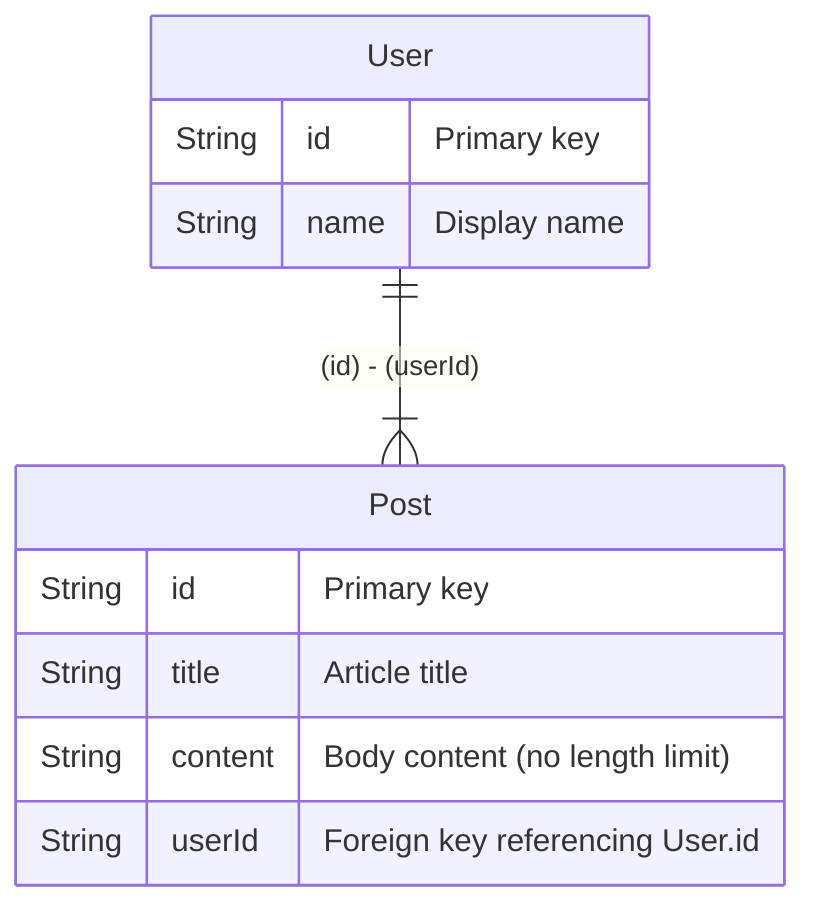

# Hekireki


**[Hekireki](https://www.npmjs.com/package/hekireki)** is a tool that generates validation schemas for Zod and Valibot, as well as ER diagrams, from [Prisma](https://www.prisma.io/) schemas annotated with comments.

## Features

- 💎 Automatically generates [Zod](https://zod.dev/) schemas from your Prisma schema
- 🤖 Automatically generates [Valibot](https://valibot.dev/) schemas from your Prisma schema
- 📊 Creates [Mermaid](https://mermaid.js.org/) ER diagrams
- 🧪 Generates [Ecto](https://hexdocs.pm/ecto/Ecto.Schema.html) schemas for Elixir projects
  ⚠️ Foreign key constraints are **not** included — manage relationships in your application logic

## Installation

```bash
npm install -D hekireki
```

## Usage

Prepare `schema.prisma`:

```prisma
generator client {
    provider = "prisma-client-js"
}

datasource db {
    provider = "sqlite"
    url      = env("DATABASE_URL")
}

generator Hekireki-ER {
    provider = "hekireki-mermaid-er"
}

generator Hekireki-Zod {
    provider = "hekireki-zod"
    type     = true
    comment  = true
    relation = true
}

generator Hekireki-Valibot {
    provider = "hekireki-valibot"
    type     = true
    comment  = true
    relation = true
}

generator Hekireki-Ecto {
    provider = "hekireki-ecto"
    output = "schema"
    app = "DBSchema"
}

model User {
    /// Primary key
    /// @z.uuid()
    /// @v.pipe(v.string(), v.uuid())
    id    String @id @default(uuid())
    /// Display name
    /// @z.string().min(1).max(50)
    /// @v.pipe(v.string(), v.minLength(1), v.maxLength(50))
    name  String
    /// One-to-many relation to Post
    posts Post[]
}

/// @relation User.id Post.userId one-to-many
model Post {
    /// Primary key
    /// @z.uuid()
    /// @v.pipe(v.string(), v.uuid())
    id String @id @default(uuid())
    /// Article title
    /// @z.string().min(1).max(100)
    /// @v.pipe(v.string(), v.minLength(1), v.maxLength(100))
    title String
    /// Body content (no length limit)
    /// @z.string()
    /// @v.string()
    content String
    /// Foreign key referencing User.id
    /// @z.uuid()
    /// @v.pipe(v.string(), v.uuid())
    userId  String
    /// Prisma relation definition
    user    User   @relation(fields: [userId], references: [id])
}
```

## Generate

## Zod

```ts
import * as z from 'zod'

export const UserSchema = z.object({
  /**
   * Primary key
   */
  id: z.uuid(),
  /**
   * Display name
   */
  name: z.string().min(1).max(50),
})

export type User = z.infer<typeof UserSchema>

export const PostSchema = z.object({
  /**
   * Primary key
   */
  id: z.uuid(),
  /**
   * Article title
   */
  title: z.string().min(1).max(100),
  /**
   * Body content (no length limit)
   */
  content: z.string(),
  /**
   * Foreign key referencing User.id
   */
  userId: z.uuid(),
})

export type Post = z.infer<typeof PostSchema>

export const UserRelationsSchema = z.object({
  ...UserSchema.shape,
  posts: z.array(PostSchema),
})

export type UserRelations = z.infer<typeof UserRelationsSchema>

export const PostRelationsSchema = z.object({
  ...PostSchema.shape,
  user: UserSchema,
})

export type PostRelations = z.infer<typeof PostRelationsSchema>
```

## Valibot
```ts
import * as v from 'valibot'

export const UserSchema = v.object({
  /**
   * Primary key
   */
  id: v.pipe(v.string(), v.uuid()),
  /**
   * Display name
   */
  name: v.pipe(v.string(), v.minLength(1), v.maxLength(50)),
})

export type User = v.InferInput<typeof UserSchema>

export const PostSchema = v.object({
  /**
   * Primary key
   */
  id: v.pipe(v.string(), v.uuid()),
  /**
   * Article title
   */
  title: v.pipe(v.string(), v.minLength(1), v.maxLength(100)),
  /**
   * Body content (no length limit)
   */
  content: v.string(),
  /**
   * Foreign key referencing User.id
   */
  userId: v.pipe(v.string(), v.uuid()),
})

export type Post = v.InferInput<typeof PostSchema>

export const UserRelationsSchema = v.object({ ...UserSchema.entries, posts: v.array(PostSchema) })

export type UserRelations = v.InferInput<typeof UserRelationsSchema>

export const PostRelationsSchema = v.object({ ...PostSchema.entries, user: UserSchema })

export type PostRelations = v.InferInput<typeof PostRelationsSchema>
```

## Mermaid



## Ecto

```elixir
defmodule DBSchema.User do
  use Ecto.Schema

  @primary_key {:id, :binary_id, autogenerate: true}

  @type t :: %__MODULE__{
          id: Ecto.UUID.t(),
          name: String.t()
        }

  schema "user" do
    field(:name, :string)
  end
end
```

```elixir
defmodule DBSchema.Post do
  use Ecto.Schema

  @primary_key {:id, :binary_id, autogenerate: true}

  @type t :: %__MODULE__{
          id: Ecto.UUID.t(),
          title: String.t(),
          content: String.t(),
          userId: String.t()
        }

  schema "post" do
    field(:title, :string)
    field(:content, :string)
    field(:userId, :string)
  end
end
```

## Configuration

### Zod Generator Options

| Option       | Type      | Default                             | Description                                      |
|--------------|-----------|-------------------------------------|--------------------------------------------------|
| `output`     | `string`  | `./zod`                             | Output directory                                 |
| `file`       | `string`  | `index.ts`                          | File Name                                        |
| `type`       | `boolean` | `false`                             | Generate TypeScript types                        |
| `comment`    | `boolean` | `false`                             | Include schema documentation                     |
| `zod`        | `string`  | `'v4'`                              | Zod import version (`'mini'`, `'@hono/zod-openapi'`, or default `'v4'`) |
| `relation`   | `boolean` | `false`                             | Generate relation schemas                        |

### Valibot Generator Options

| Option       | Type      | Default                             | Description                                      |
|--------------|-----------|-------------------------------------|--------------------------------------------------|
| `output`     | `string`  | `./valibot`                         | Output directory                                 |
| `file`       | `string`  | `index.ts`                          | File Name                                        |
| `type`       | `boolean` | `false`                             | Generate TypeScript types                        |
| `comment`    | `boolean` | `false`                             | Include schema documentation                     |
| `relation`   | `boolean` | `false`                             | Generate relation schemas                        |

### Mermaid ER Generator Options

| Option       | Type      | Default                             | Description                                      |
|--------------|-----------|-------------------------------------|--------------------------------------------------|
| `output`     | `string`  | `./mermaid-er`                      | Output directory                                 |
| `file`       | `string`  | `ER.md`                             | File Name                                        |

### Ecto Generator Options

| Option       | Type      | Default                             | Description                                      |
|--------------|-----------|-------------------------------------|--------------------------------------------------|
| `output`     | `string`  | `./ecto`                            | Output directory                                 |
| `app`        | `string`  | `MyApp`                             | App Name                                        |

⚠️ WARNING: Potential Breaking Changes Without Notice

This project is in **early development** and being maintained by a developer with about 2 years of experience. While I'm doing my best to create a useful tool:


## License

Distributed under the MIT License. See [LICENSE](https://github.com/nakita628/hekireki?tab=MIT-1-ov-file) for more information.