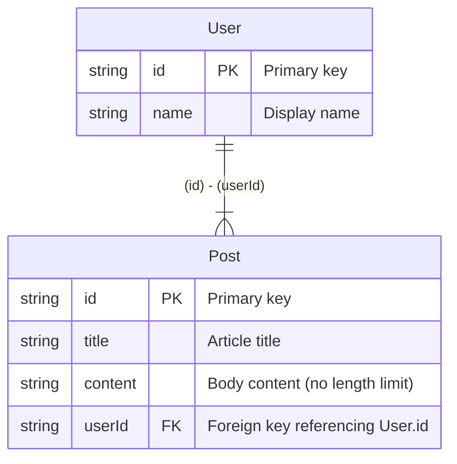

# Hekireki

**[Hekireki](https://www.npmjs.com/package/hekireki)** is a tool that generates validation schemas, ORM models, and ER diagrams from [Prisma](https://www.prisma.io/) schemas — supporting TypeScript, Python, Go, Rust, and Elixir.

## Features

### TypeScript Validation Libraries

- 💎 Automatically generates [Zod](https://zod.dev/) schemas from your Prisma schema
- 🤖 Automatically generates [Valibot](https://valibot.dev/) schemas from your Prisma schema
- 🏹 Automatically generates [ArkType](https://arktype.io/) schemas from your Prisma schema
- ⚡ Automatically generates [Effect Schema](https://effect.website/docs/schema/introduction/) from your Prisma schema
- 📦 Automatically generates [TypeBox](https://github.com/sinclairzx81/typebox) schemas from your Prisma schema
- 📋 Automatically generates [AJV](https://ajv.js.org/)-compatible JSON Schema objects from your Prisma schema

### ORM / Schema Generation (Multi-Language)

- 🗄️ Automatically generates [Drizzle ORM](https://orm.drizzle.team/) table schemas and relations from your Prisma schema
- 🐍 Automatically generates [SQLAlchemy](https://www.sqlalchemy.org/) models (Python) — with `Mapped[T]` type hints, relationships, enums, composite keys, and index support
- 🐹 Automatically generates [GORM](https://gorm.io/) models (Go) — with struct tags, JSON tags, relationships, enums, composite keys, and index support
- 🦀 Automatically generates [Sea-ORM](https://www.sea-ql.org/SeaORM/) entities (Rust) — with `DeriveEntityModel`, relations, enums, serde support, and `rename_all`
- 🧪 Generates [Ecto](https://hexdocs.pm/ecto/Ecto.Schema.html) schemas (Elixir) — with associations (`belongs_to`, `has_many`, `has_one`), composite primary keys, `@type t` typespecs, array fields, `@@map`/`@map` support, and `@moduledoc`

### Diagrams & Documentation

- 📊 Creates [Mermaid](https://mermaid.js.org/) ER diagrams with PK/FK markers
- 📝 Generates [DBML](https://dbml.dbdiagram.io/) (Database Markup Language) files and **PNG** ER diagrams via [dbml-renderer](https://github.com/softwaretechnik-berlin/dbml-renderer) — output format is determined by the file extension (`.dbml` or `.png`)

## Installation

```bash
npm install -D hekireki
```

## Usage

Prepare `schema.prisma`:

```prisma
datasource db {
    provider = "sqlite"
}

generator Hekireki-ER {
    provider = "hekireki-mermaid-er"
}

generator Hekireki-Zod {
    provider = "hekireki-zod"
    type     = true
    comment  = true
    relation = true
}

generator Hekireki-Valibot {
    provider = "hekireki-valibot"
    type     = true
    comment  = true
    relation = true
}

generator Hekireki-ArkType {
    provider = "hekireki-arktype"
    type     = true
    comment  = true
    relation = true
}

generator Hekireki-Effect {
    provider = "hekireki-effect"
    type     = true
    comment  = true
    relation = true
}

generator Hekireki-TypeBox {
    provider = "hekireki-typebox"
    type     = true
    comment  = true
    relation = true
}

generator Hekireki-AJV {
    provider = "hekireki-ajv"
    type     = true
    comment  = true
    relation = true
}

generator Hekireki-Drizzle {
    provider = "hekireki-drizzle"
}

generator Hekireki-SQLAlchemy {
    provider = "hekireki-sqlalchemy"
    output   = "./sqlalchemy"
}

generator Hekireki-GORM {
    provider = "hekireki-gorm"
    output   = "./gorm"
    package  = "model"
}

generator Hekireki-SeaORM {
    provider   = "hekireki-sea-orm"
    output     = "./sea_orm"
    serde      = true
    renameAll  = "camelCase"
}

generator Hekireki-Ecto {
    provider = "hekireki-ecto"
    output = "./ecto"
    app = "DBSchema"
}

generator Hekireki-DBML {
    provider = "hekireki-dbml"
    output   = "docs/schema.dbml"
}

generator Hekireki-Docs {
    provider = "hekireki-docs"
    output   = "./docs"
}

model User {
    /// Primary key
    /// @z.uuid()
    /// @v.pipe(v.string(), v.uuid())
    /// @a."string.uuid"
    /// @e.Schema.UUID
    /// @t.Type.String({ format: 'uuid' })
    /// @j.{ type: 'string' as const, format: 'uuid' as const }
    id    String @id @default(uuid())
    /// Display name
    /// @z.string().min(1).max(50)
    /// @v.pipe(v.string(), v.minLength(1), v.maxLength(50))
    /// @a."1 <= string <= 50"
    /// @e.Schema.String.pipe(Schema.minLength(1), Schema.maxLength(50))
    /// @t.Type.String({ minLength: 1, maxLength: 50 })
    /// @j.{ type: 'string' as const, minLength: 1, maxLength: 50 }
    name  String
    /// One-to-many relation to Post
    posts Post[]
}

model Post {
    /// Primary key
    /// @z.uuid()
    /// @v.pipe(v.string(), v.uuid())
    /// @a."string.uuid"
    /// @e.Schema.UUID
    /// @t.Type.String({ format: 'uuid' })
    /// @j.{ type: 'string' as const, format: 'uuid' as const }
    id String @id @default(uuid())
    /// Article title
    /// @z.string().min(1).max(100)
    /// @v.pipe(v.string(), v.minLength(1), v.maxLength(100))
    /// @a."1 <= string <= 100"
    /// @e.Schema.String.pipe(Schema.minLength(1), Schema.maxLength(100))
    /// @t.Type.String({ minLength: 1, maxLength: 100 })
    /// @j.{ type: 'string' as const, minLength: 1, maxLength: 100 }
    title String
    /// Body content (no length limit)
    /// @z.string()
    /// @v.string()
    /// @a."string"
    /// @e.Schema.String
    /// @t.Type.String()
    /// @j.{ type: 'string' as const }
    content String
    /// Foreign key referencing User.id
    /// @z.uuid()
    /// @v.pipe(v.string(), v.uuid())
    /// @a."string.uuid"
    /// @e.Schema.UUID
    /// @t.Type.String({ format: 'uuid' })
    /// @j.{ type: 'string' as const, format: 'uuid' as const }
    userId  String
    /// Prisma relation definition
    user    User   @relation(fields: [userId], references: [id])
}
```

## Generated Output

### Zod

```ts
import * as z from 'zod'

export const UserSchema = z.object({
  /**
   * Primary key
   */
  id: z.uuid(),
  /**
   * Display name
   */
  name: z.string().min(1).max(50),
})

export type User = z.infer<typeof UserSchema>

export const PostSchema = z.object({
  /**
   * Primary key
   */
  id: z.uuid(),
  /**
   * Article title
   */
  title: z.string().min(1).max(100),
  /**
   * Body content (no length limit)
   */
  content: z.string(),
  /**
   * Foreign key referencing User.id
   */
  userId: z.uuid(),
})

export type Post = z.infer<typeof PostSchema>

export const UserRelationsSchema = z.object({
  ...UserSchema.shape,
  posts: z.array(PostSchema),
})

export type UserRelations = z.infer<typeof UserRelationsSchema>

export const PostRelationsSchema = z.object({
  ...PostSchema.shape,
  user: UserSchema,
})

export type PostRelations = z.infer<typeof PostRelationsSchema>
```

### Valibot

```ts
import * as v from 'valibot'

export const UserSchema = v.object({
  /**
   * Primary key
   */
  id: v.pipe(v.string(), v.uuid()),
  /**
   * Display name
   */
  name: v.pipe(v.string(), v.minLength(1), v.maxLength(50)),
})

export type User = v.InferInput<typeof UserSchema>

export const PostSchema = v.object({
  /**
   * Primary key
   */
  id: v.pipe(v.string(), v.uuid()),
  /**
   * Article title
   */
  title: v.pipe(v.string(), v.minLength(1), v.maxLength(100)),
  /**
   * Body content (no length limit)
   */
  content: v.string(),
  /**
   * Foreign key referencing User.id
   */
  userId: v.pipe(v.string(), v.uuid()),
})

export type Post = v.InferInput<typeof PostSchema>

export const UserRelationsSchema = v.object({
  ...UserSchema.entries,
  posts: v.array(PostSchema),
})

export type UserRelations = v.InferInput<typeof UserRelationsSchema>

export const PostRelationsSchema = v.object({
  ...PostSchema.entries,
  user: UserSchema,
})

export type PostRelations = v.InferInput<typeof PostRelationsSchema>
```

### ArkType

```ts
import { type } from 'arktype'

export const UserSchema = type({
  /** Primary key */
  id: 'string.uuid',
  /** Display name */
  name: '1 <= string <= 50',
})

export type User = typeof UserSchema.infer

export const PostSchema = type({
  /** Primary key */
  id: 'string.uuid',
  /** Article title */
  title: '1 <= string <= 100',
  /** Body content (no length limit) */
  content: 'string',
  /** Foreign key referencing User.id */
  userId: 'string.uuid',
})

export type Post = typeof PostSchema.infer
```

### Effect Schema

```ts
import { Schema } from 'effect'

export const UserSchema = Schema.Struct({
  /** Primary key */
  id: Schema.UUID,
  /** Display name */
  name: Schema.String.pipe(Schema.minLength(1), Schema.maxLength(50)),
})

export type User = Schema.Schema.Type<typeof UserSchema>

export const PostSchema = Schema.Struct({
  /** Primary key */
  id: Schema.UUID,
  /** Article title */
  title: Schema.String.pipe(Schema.minLength(1), Schema.maxLength(100)),
  /** Body content (no length limit) */
  content: Schema.String,
  /** Foreign key referencing User.id */
  userId: Schema.UUID,
})

export type Post = Schema.Schema.Type<typeof PostSchema>
```

### TypeBox

```ts
import { type Static, Type } from '@sinclair/typebox'

export const UserSchema = Type.Object({
  /** Primary key */
  id: Type.String({ format: 'uuid' }),
  /** Display name */
  name: Type.String({ minLength: 1, maxLength: 50 }),
})

export type User = Static<typeof UserSchema>

export const PostSchema = Type.Object({
  /** Primary key */
  id: Type.String({ format: 'uuid' }),
  /** Article title */
  title: Type.String({ minLength: 1, maxLength: 100 }),
  /** Body content (no length limit) */
  content: Type.String(),
  /** Foreign key referencing User.id */
  userId: Type.String({ format: 'uuid' }),
})

export type Post = Static<typeof PostSchema>

export const UserRelationsSchema = Type.Object({
  ...UserSchema.properties,
  posts: Type.Array(PostSchema),
})

export type UserRelations = Static<typeof UserRelationsSchema>

export const PostRelationsSchema = Type.Object({
  ...PostSchema.properties,
  user: UserSchema,
})

export type PostRelations = Static<typeof PostRelationsSchema>
```

### AJV (JSON Schema)

```ts
import type { FromSchema } from 'json-schema-to-ts'

export const UserSchema = {
  type: 'object' as const,
  properties: {
    /** Primary key */
    id: { type: 'string' as const, format: 'uuid' as const },
    /** Display name */
    name: { type: 'string' as const, minLength: 1, maxLength: 50 },
  },
  required: ['id', 'name'] as const,
  additionalProperties: false,
} as const

export type User = FromSchema<typeof UserSchema>

export const PostSchema = {
  type: 'object' as const,
  properties: {
    /** Primary key */
    id: { type: 'string' as const, format: 'uuid' as const },
    /** Article title */
    title: { type: 'string' as const, minLength: 1, maxLength: 100 },
    /** Body content (no length limit) */
    content: { type: 'string' as const },
    /** Foreign key referencing User.id */
    userId: { type: 'string' as const, format: 'uuid' as const },
  },
  required: ['id', 'title', 'content', 'userId'] as const,
  additionalProperties: false,
} as const

export type Post = FromSchema<typeof PostSchema>

export const UserRelationsSchema = {
  type: 'object' as const,
  properties: {
    ...UserSchema.properties,
    posts: { type: 'array' as const, items: PostSchema },
  },
  additionalProperties: false,
} as const

export type UserRelations = FromSchema<typeof UserRelationsSchema>

export const PostRelationsSchema = {
  type: 'object' as const,
  properties: {
    ...PostSchema.properties,
    user: UserSchema,
  },
  additionalProperties: false,
} as const

export type PostRelations = FromSchema<typeof PostRelationsSchema>
```

### Drizzle

```ts
import { sqliteTable, text } from 'drizzle-orm/sqlite-core'
import { relations } from 'drizzle-orm'

export const user = sqliteTable('user', {
  id: text('id')
    .primaryKey()
    .$defaultFn(() => crypto.randomUUID()),
  name: text('name').notNull(),
})

export const post = sqliteTable('post', {
  id: text('id')
    .primaryKey()
    .$defaultFn(() => crypto.randomUUID()),
  title: text('title').notNull(),
  content: text('content').notNull(),
  userId: text('userId').notNull(),
})

export const userRelations = relations(user, ({ many }) => ({ posts: many(post) }))

export const postRelations = relations(post, ({ one }) => ({
  user: one(user, { fields: [post.userId], references: [user.id] }),
}))
```

### Mermaid


```mermaid
erDiagram
    User ||--}| Post : "(id) - (userId)"
    User {
        string id PK "Primary key"
        string name "Display name"
    }
    Post {
        string id PK "Primary key"
        string title "Article title"
        string content "Body content (no length limit)"
        string userId FK "Foreign key referencing User.id"
    }
```

### Ecto

Each model is output as a separate `.ex` file (1 model = 1 file), following Elixir conventions.

```elixir
defmodule DBSchema.User do
  use Ecto.Schema
  @moduledoc false

  @primary_key {:id, :binary_id, autogenerate: true}
  @foreign_key_type :binary_id

  @type t :: %__MODULE__{
          id: Ecto.UUID.t(),
          name: String.t(),
          posts: [DBSchema.Post.t()]
        }

  schema "user" do
    field(:name, :string)
    has_many(:posts, DBSchema.Post, foreign_key: :user_id)
  end
end
```

```elixir
defmodule DBSchema.Post do
  use Ecto.Schema
  @moduledoc false

  @primary_key {:id, :binary_id, autogenerate: true}
  @foreign_key_type :binary_id

  @type t :: %__MODULE__{
          id: Ecto.UUID.t(),
          title: String.t(),
          content: String.t(),
          user: DBSchema.User.t() | nil
        }

  schema "post" do
    field(:title, :string)
    field(:content, :string)
    field(:user_id, :binary_id, source: :userId)
    belongs_to(:user, DBSchema.User, foreign_key: :user_id, define_field: false)
  end
end
```

### SQLAlchemy

```python
from sqlalchemy import ForeignKey
from sqlalchemy.orm import DeclarativeBase, Mapped, mapped_column, relationship


class Base(DeclarativeBase):
    pass


class User(Base):
    __tablename__ = "user"

    id: Mapped[str] = mapped_column(primary_key=True)
    name: Mapped[str]

    posts: Mapped[list["Post"]] = relationship(back_populates="user")


class Post(Base):
    __tablename__ = "post"

    id: Mapped[str] = mapped_column(primary_key=True)
    title: Mapped[str]
    content: Mapped[str]
    user_id: Mapped[str] = mapped_column(ForeignKey("user.id"))

    user: Mapped["User"] = relationship(back_populates="posts")
```

### GORM

```go
package model

type User struct {
	ID   string `gorm:"column:id;primaryKey;type:char(36)" json:"id"`
	Name string `gorm:"column:name;not null" json:"name"`
	Posts []Post `gorm:"foreignKey:UserID"`
}

type Post struct {
	ID      string `gorm:"column:id;primaryKey;type:char(36)" json:"id"`
	Title   string `gorm:"column:title;not null" json:"title"`
	Content string `gorm:"column:content;not null" json:"content"`
	UserID  string `gorm:"column:user_id;not null" json:"user_id"`
	User    User
}
```

### Sea-ORM

Each model is output as a separate `.rs` file with `mod.rs` and `prelude.rs`, following Sea-ORM conventions.

**user.rs:**

```rust
use sea_orm::entity::prelude::*;
use serde::{Deserialize, Serialize};

#[derive(Clone, Debug, PartialEq, DeriveEntityModel, Serialize, Deserialize)]
#[serde(rename_all = "camelCase")]
#[sea_orm(table_name = "user")]
pub struct Model {
    #[sea_orm(primary_key, auto_increment = false)]
    pub id: String,
    pub name: String,
}

#[derive(Copy, Clone, Debug, EnumIter, DeriveRelation)]
pub enum Relation {
    #[sea_orm(has_many = "super::post::Entity")]
    Posts,
}

impl Related<super::post::Entity> for Entity {
    fn to() -> RelationDef {
        Relation::Posts.def()
    }
}

impl ActiveModelBehavior for ActiveModel {}
```

### DBML

```dbml
Table User {
  id String [pk, note: 'Primary key']
  name String [not null, note: 'Display name']
  posts Post [not null, note: 'One-to-many relation to Post']
}

Table Post {
  id String [pk, note: 'Primary key']
  title String [not null, note: 'Article title']
  content String [not null, note: 'Body content (no length limit)']
  userId String [not null, note: 'Foreign key referencing User.id']
  user User [not null, note: 'Prisma relation definition']
}

Ref Post_userId_fk: Post.userId > User.id
```

### PNG

The `hekireki-dbml` generator also outputs ER diagrams as PNG images when the `output` path ends with `.png`:

```prisma
generator Hekireki-PNG {
    provider = "hekireki-dbml"
    output   = "docs/er-diagram.png"
}
```

### Docs

The `hekireki-docs` generator creates an HTML documentation page from your Prisma schema. Serve it locally with `hekireki docs serve`:

```prisma
generator Hekireki-Docs {
    provider = "hekireki-docs"
    output   = "./docs"
}
```

## Configuration

Configure each generator directly in your `schema.prisma` file:

```prisma
// Zod Generator
generator Hekireki-Zod {
    provider = "hekireki-zod"
    output   = "./zod"       // Output path (default: ./zod/index.ts)
    type     = true          // Generate TypeScript types (default: false)
    comment  = true          // Include schema documentation (default: false)
    zod      = "v4"          // Zod import: "v4", "mini", or "@hono/zod-openapi" (default: v4)
    relation = true          // Generate relation schemas (default: false)
}

// Valibot Generator
generator Hekireki-Valibot {
    provider = "hekireki-valibot"
    output   = "./valibot"   // Output path (default: ./valibot/index.ts)
    type     = true          // Generate TypeScript types (default: false)
    comment  = true          // Include schema documentation (default: false)
    relation = true          // Generate relation schemas (default: false)
}

// ArkType Generator
generator Hekireki-ArkType {
    provider = "hekireki-arktype"
    output   = "./arktype"   // Output path (default: ./arktype/index.ts)
    type     = true          // Generate TypeScript types (default: false)
    comment  = true          // Include schema documentation (default: false)
    relation = true          // Generate relation schemas (default: false)
}

// Effect Schema Generator
generator Hekireki-Effect {
    provider = "hekireki-effect"
    output   = "./effect"    // Output path (default: ./effect/index.ts)
    type     = true          // Generate TypeScript types (default: false)
    comment  = true          // Include schema documentation (default: false)
    relation = true          // Generate relation schemas (default: false)
}

// TypeBox Generator
generator Hekireki-TypeBox {
    provider = "hekireki-typebox"
    output   = "./typebox"   // Output path (default: ./typebox/index.ts)
    type     = true          // Generate TypeScript types (default: false)
    comment  = true          // Include schema documentation (default: false)
    relation = true          // Generate relation schemas (default: false)
}

// AJV (JSON Schema) Generator
generator Hekireki-AJV {
    provider = "hekireki-ajv"
    output   = "./ajv"       // Output path (default: ./ajv/index.ts)
    type     = true          // Generate TypeScript types (default: false)
    comment  = true          // Include schema documentation (default: false)
    relation = true          // Generate relation schemas (default: false)
}

// Drizzle ORM Schema Generator
generator Hekireki-Drizzle {
    provider = "hekireki-drizzle"
    output   = "./drizzle"   // Output path (default: ./drizzle/schema.ts)
}

// Mermaid ER Generator
generator Hekireki-ER {
    provider = "hekireki-mermaid-er"
    output   = "./mermaid-er" // Output path (default: ./mermaid-er/ER.md)
}

// SQLAlchemy Generator (Python)
generator Hekireki-SQLAlchemy {
    provider = "hekireki-sqlalchemy"
    output   = "./sqlalchemy"      // Output path (default: ./sqlalchemy/models.py)
}

// GORM Generator (Go)
generator Hekireki-GORM {
    provider = "hekireki-gorm"
    output   = "./gorm"            // Output path (default: ./gorm/models.go)
    package  = "model"             // Go package name (default: model)
}

// Sea-ORM Generator (Rust)
generator Hekireki-SeaORM {
    provider   = "hekireki-sea-orm"
    output     = "./sea_orm"       // Output directory for .rs files
    serde      = true              // Derive Serialize/Deserialize (default: true)
    renameAll  = "camelCase"       // #[serde(rename_all = "...")] attribute (optional)
}

// Ecto Generator (Elixir)
generator Hekireki-Ecto {
    provider = "hekireki-ecto"
    output   = "./ecto"      // Output directory (default: ./ecto/)
    app      = "MyApp"       // App name (default: MyApp)
}

// DBML Generator (output extension determines format: .dbml or .png)
generator Hekireki-DBML {
    provider = "hekireki-dbml"
    output   = "docs/schema.dbml"    // File path ending in .dbml or .png
    mapToDbSchema = true             // Map to DB schema names (default: true)
}

// PNG output (same provider, different extension)
generator Hekireki-PNG {
    provider = "hekireki-dbml"
    output   = "docs/er-diagram.png" // .png extension → PNG output
    mapToDbSchema = true             // Map to DB schema names (default: true)
}

// Docs Generator
generator Hekireki-Docs {
    provider = "hekireki-docs"
    output   = "./docs"              // Output directory (default: ./docs)
}
```

## Docs Server

Hekireki includes a built-in documentation server powered by [Hono](https://hono.dev/). After generating docs with `prisma generate`, you can preview them locally:

```bash
# Start the docs server (default: http://localhost:5858)
hekireki docs serve

# Specify a custom port
hekireki docs serve -p 3000
```

> **Note:** Run `prisma generate` first to generate the `docs/` directory with `index.html`.

## License

Distributed under the MIT License. See [LICENSE](https://github.com/nakita628/hekireki?tab=MIT-1-ov-file) for more information.
