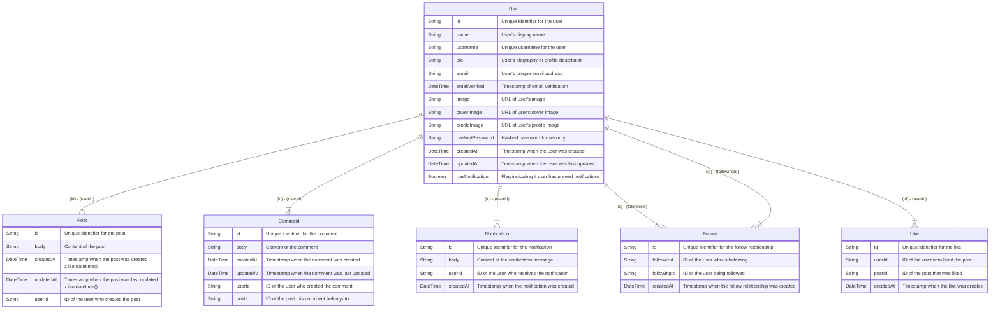

```mermaid
erDiagram
    User ||--}| Post : "(id) - (userId)"
    User ||--}| Comment : "(id) - (userId)"
    User ||--}| Notification : "(id) - (userId)"
    User ||--}| Follow : "(id) - (followerId)"
    User ||--}| Follow : "(id) - (followingId)"
    User ||--}| Like : "(id) - (userId)"
    User {
        String id "Unique identifier for the user"
        String name "User's display name"
        String username "Unique username for the user"
        String bio "User's biography or profile description"
        String email "User's unique email address"
        DateTime emailVerified "Timestamp of email verification"
        String image "URL of user's image"
        String coverImage "URL of user's cover image"
        String profileImage "URL of user's profile image"
        String hashedPassword "Hashed password for security"
        DateTime createdAt "Timestamp when the user was created"
        DateTime updatedAt "Timestamp when the user was last updated"
        Boolean hasNotification "Flag indicating if user has unread notifications"
    }
    Post {
        String id "Unique identifier for the post"
        String body "Content of the post"
        DateTime createdAt "Timestamp when the post was created
z.iso.datetime()"
        DateTime updatedAt "Timestamp when the post was last updated
z.iso.datetime()"
        String userId "ID of the user who created the post"
    }
    Follow {
        String id "Unique identifier for the follow relationship"
        String followerId "ID of the user who is following"
        String followingId "ID of the user being followed"
        DateTime createdAt "Timestamp when the follow relationship was created"
    }
    Like {
        String id "Unique identifier for the like"
        String userId "ID of the user who liked the post"
        String postId "ID of the post that was liked"
        DateTime createdAt "Timestamp when the like was created"
    }
    Comment {
        String id "Unique identifier for the comment"
        String body "Content of the comment"
        DateTime createdAt "Timestamp when the comment was created"
        DateTime updatedAt "Timestamp when the comment was last updated"
        String userId "ID of the user who created the comment"
        String postId "ID of the post this comment belongs to"
    }
    Notification {
        String id "Unique identifier for the notification"
        String body "Content of the notification message"
        String userId "ID of the user who receives the notification"
        DateTime createdAt "Timestamp when the notification was created"
    }
```