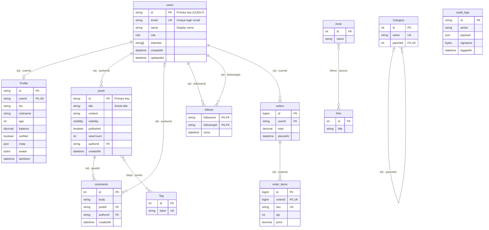

```mermaid
erDiagram
    users ||--o| Profile : "(id) - (userId)"
    users ||--o{ posts : "(id) - (authorId)"
    posts ||--o{ comments : "(id) - (postId)"
    users |o--o{ comments : "(id) - (authorId)"
    users ||--o{ follows : "(id) - (followerId)"
    users ||--o{ follows : "(id) - (followingId)"
    Category |o--o{ Category : "(id) - (parentId)"
    users ||--o{ orders : "(id) - (userId)"
    orders ||--o{ order_items : "(id) - (orderId)"
    posts }o--o{ Tag : "(tags) - (posts)"
    Actor }o--o{ Film : "(films) - (actors)"
    users {
        string id PK "Primary key (UUIDv7)"
        string email UK "Unique login email"
        string name "Display name"
        role role
        string[] interests
        datetime createdAt
        datetime updatedAt
    }
    Profile {
        string id PK
        string userId FK, UK
        string bio
        string nickname
        int age
        decimal balance
        boolean verified
        json meta
        bytes avatar
        datetime lastSeen
    }
    posts {
        string id PK "Primary key"
        string title "Article title"
        string content
        visibility visibility
        boolean published
        int viewCount
        string authorId FK
        datetime createdAt
    }
    Tag {
        int id PK
        string label UK
    }
    comments {
        int id PK
        string body
        string postId FK
        string authorId FK
        datetime createdAt
    }
    follows {
        string followerId PK, FK
        string followingId PK, FK
        datetime since
    }
    Category {
        int id PK
        string name UK
        int parentId FK, UK
    }
    orders {
        bigint id PK
        string userId FK
        decimal total
        datetime placedAt
    }
    order_items {
        bigint id PK
        bigint orderId FK, UK
        string sku UK
        int qty
        decimal price
    }
    audit_logs {
        string id PK
        string action
        json payload
        bytes signature
        datetime loggedAt
    }
    Actor {
        int id PK
        string name
    }
    Film {
        int id PK
        string title
    }
```