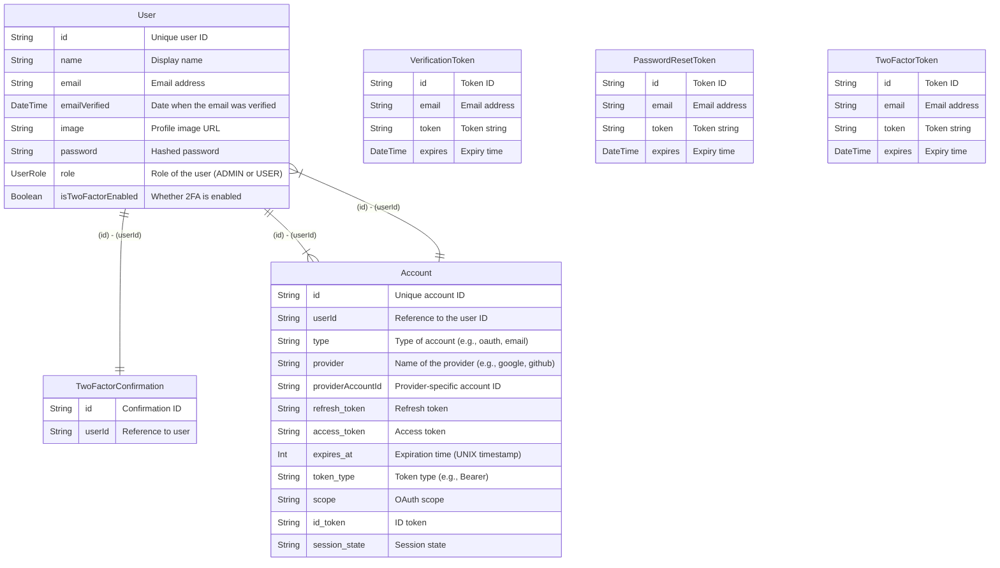

```mermaid
erDiagram
    User ||--|| TwoFactorConfirmation : "(id) - (userId)"
    User ||--}| Account : "(id) - (userId)"
    User }|--|| Account : "(id) - (userId)"
    User {
        String id "Unique user ID"
        String name "Display name"
        String email "Email address"
        DateTime emailVerified "Date when the email was verified"
        String image "Profile image URL"
        String password "Hashed password"
        UserRole role "Role of the user (ADMIN or USER)"
        Boolean isTwoFactorEnabled "Whether 2FA is enabled"
    }
    Account {
        String id "Unique account ID"
        String userId "Reference to the user ID"
        String type "Type of account (e.g., oauth, email)"
        String provider "Name of the provider (e.g., google, github)"
        String providerAccountId "Provider-specific account ID"
        String refresh_token "Refresh token"
        String access_token "Access token"
        Int expires_at "Expiration time (UNIX timestamp)"
        String token_type "Token type (e.g., Bearer)"
        String scope "OAuth scope"
        String id_token "ID token"
        String session_state "Session state"
    }
    VerificationToken {
        String id "Token ID"
        String email "Email address"
        String token "Token string"
        DateTime expires "Expiry time"
    }
    PasswordResetToken {
        String id "Token ID"
        String email "Email address"
        String token "Token string"
        DateTime expires "Expiry time"
    }
    TwoFactorToken {
        String id "Token ID"
        String email "Email address"
        String token "Token string"
        DateTime expires "Expiry time"
    }
    TwoFactorConfirmation {
        String id "Confirmation ID"
        String userId "Reference to user"
    }
```