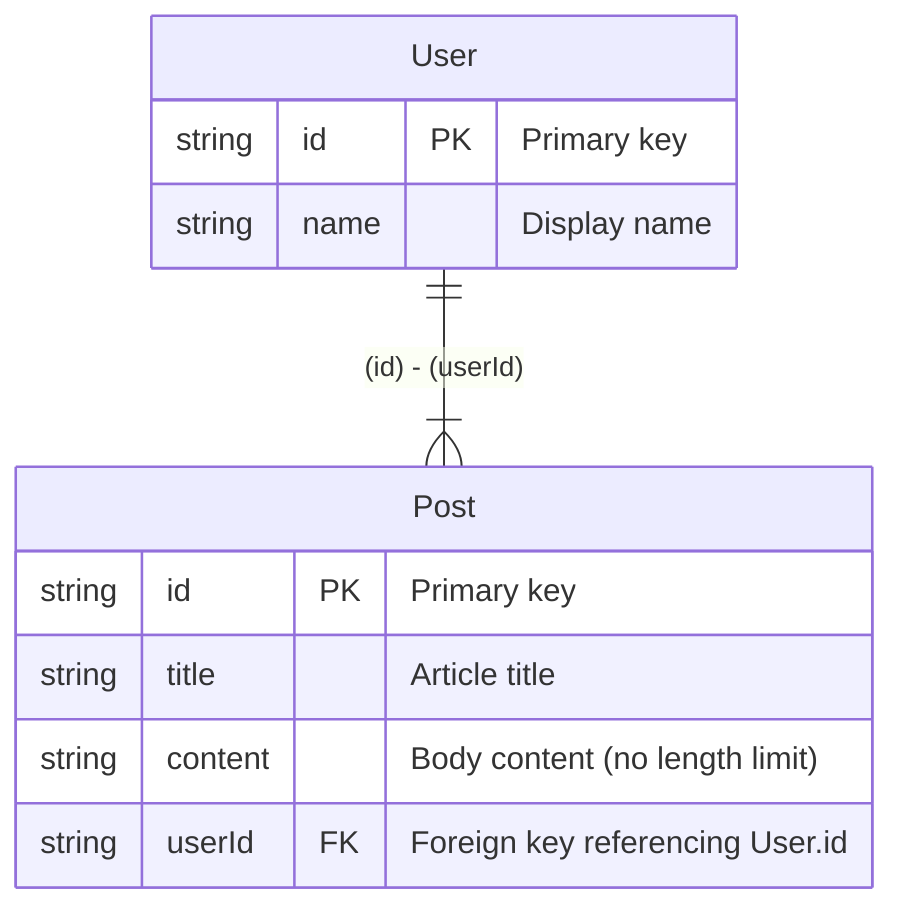

```mermaid
erDiagram
    User ||--}| Post : "(id) - (userId)"
    User {
        string id PK "Primary key"
        string name "Display name"
    }
    Post {
        string id PK "Primary key"
        string title "Article title"
        string content "Body content (no length limit)"
        string userId FK "Foreign key referencing User.id"
    }
```