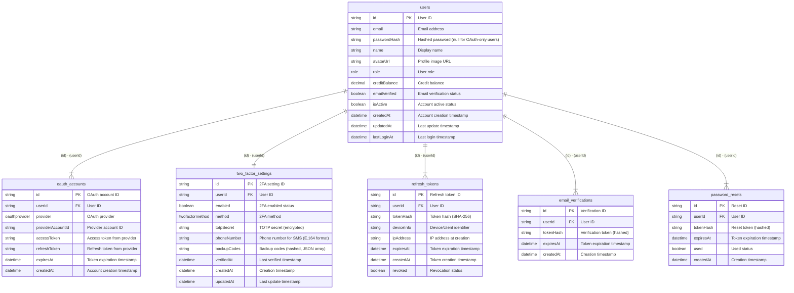

```mermaid
erDiagram
    users ||--}| oauth_accounts : "(id) - (userId)"
    users ||--|| two_factor_settings : "(id) - (userId)"
    users ||--}| refresh_tokens : "(id) - (userId)"
    users ||--}| email_verifications : "(id) - (userId)"
    users ||--}| password_resets : "(id) - (userId)"
    users {
        string id PK "User ID"
        string email "Email address"
        string passwordHash "Hashed password (null for OAuth-only users)"
        string name "Display name"
        string avatarUrl "Profile image URL"
        role role "User role"
        decimal creditBalance "Credit balance"
        boolean emailVerified "Email verification status"
        boolean isActive "Account active status"
        datetime createdAt "Account creation timestamp"
        datetime updatedAt "Last update timestamp"
        datetime lastLoginAt "Last login timestamp"
    }
    oauth_accounts {
        string id PK "OAuth account ID"
        string userId FK "User ID"
        oauthprovider provider "OAuth provider"
        string providerAccountId "Provider account ID"
        string accessToken "Access token from provider"
        string refreshToken "Refresh token from provider"
        datetime expiresAt "Token expiration timestamp"
        datetime createdAt "Account creation timestamp"
    }
    two_factor_settings {
        string id PK "2FA setting ID"
        string userId FK "User ID"
        boolean enabled "2FA enabled status"
        twofactormethod method "2FA method"
        string totpSecret "TOTP secret (encrypted)"
        string phoneNumber "Phone number for SMS (E.164 format)"
        string backupCodes "Backup codes (hashed, JSON array)"
        datetime verifiedAt "Last verified timestamp"
        datetime createdAt "Creation timestamp"
        datetime updatedAt "Last update timestamp"
    }
    refresh_tokens {
        string id PK "Refresh token ID"
        string userId FK "User ID"
        string tokenHash "Token hash (SHA-256)"
        string deviceInfo "Device/client identifier"
        string ipAddress "IP address at creation"
        datetime expiresAt "Token expiration timestamp"
        datetime createdAt "Token creation timestamp"
        boolean revoked "Revocation status"
    }
    email_verifications {
        string id PK "Verification ID"
        string userId FK "User ID"
        string tokenHash "Verification token (hashed)"
        datetime expiresAt "Token expiration timestamp"
        datetime createdAt "Creation timestamp"
    }
    password_resets {
        string id PK "Reset ID"
        string userId FK "User ID"
        string tokenHash "Reset token (hashed)"
        datetime expiresAt "Token expiration timestamp"
        boolean used "Used status"
        datetime createdAt "Creation timestamp"
    }
```
