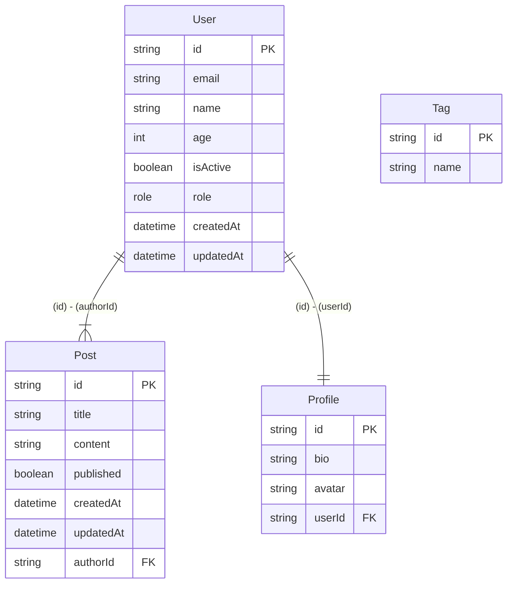

```mermaid
erDiagram
    User ||--}| Post : "(id) - (authorId)"
    User ||--|| Profile : "(id) - (userId)"
    User {
        string id PK
        string email
        string name
        int age
        boolean isActive
        role role
        datetime createdAt
        datetime updatedAt
    }
    Post {
        string id PK
        string title
        string content
        boolean published
        datetime createdAt
        datetime updatedAt
        string authorId FK
    }
    Profile {
        string id PK
        string bio
        string avatar
        string userId FK
    }
    Tag {
        string id PK
        string name
    }
```