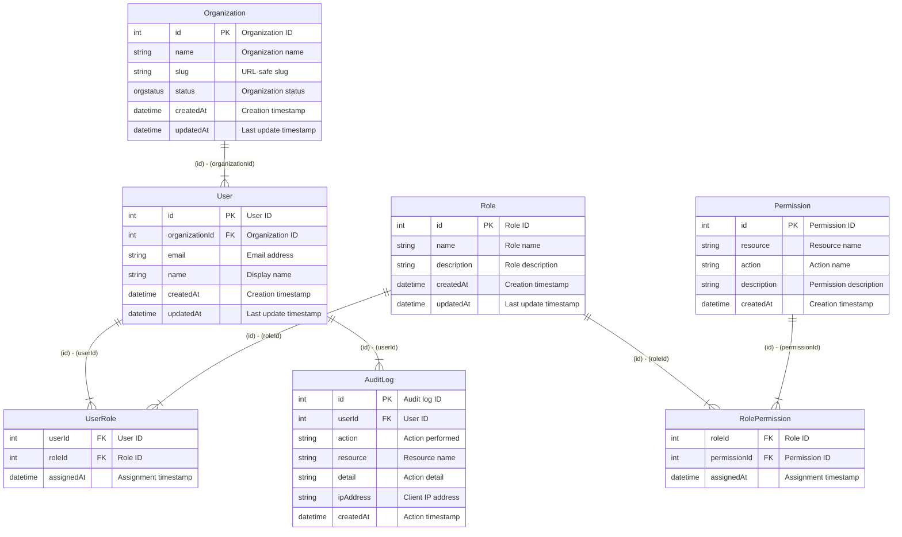

```mermaid
erDiagram
    Organization ||--}| User : "(id) - (organizationId)"
    User ||--}| UserRole : "(id) - (userId)"
    Role ||--}| UserRole : "(id) - (roleId)"
    Role ||--}| RolePermission : "(id) - (roleId)"
    Permission ||--}| RolePermission : "(id) - (permissionId)"
    User ||--}| AuditLog : "(id) - (userId)"
    Organization {
        int id PK "Organization ID"
        string name "Organization name"
        string slug "URL-safe slug"
        orgstatus status "Organization status"
        datetime createdAt "Creation timestamp"
        datetime updatedAt "Last update timestamp"
    }
    User {
        int id PK "User ID"
        int organizationId FK "Organization ID"
        string email "Email address"
        string name "Display name"
        datetime createdAt "Creation timestamp"
        datetime updatedAt "Last update timestamp"
    }
    Role {
        int id PK "Role ID"
        string name "Role name"
        string description "Role description"
        datetime createdAt "Creation timestamp"
        datetime updatedAt "Last update timestamp"
    }
    Permission {
        int id PK "Permission ID"
        string resource "Resource name"
        string action "Action name"
        string description "Permission description"
        datetime createdAt "Creation timestamp"
    }
    UserRole {
        int userId FK "User ID"
        int roleId FK "Role ID"
        datetime assignedAt "Assignment timestamp"
    }
    RolePermission {
        int roleId FK "Role ID"
        int permissionId FK "Permission ID"
        datetime assignedAt "Assignment timestamp"
    }
    AuditLog {
        int id PK "Audit log ID"
        int userId FK "User ID"
        string action "Action performed"
        string resource "Resource name"
        string detail "Action detail"
        string ipAddress "Client IP address"
        datetime createdAt "Action timestamp"
    }
```