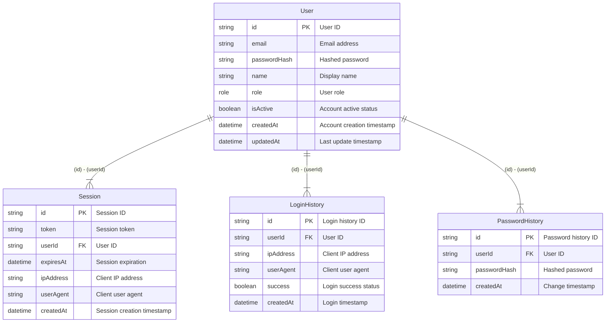

```mermaid
erDiagram
    User ||--}| Session : "(id) - (userId)"
    User ||--}| LoginHistory : "(id) - (userId)"
    User ||--}| PasswordHistory : "(id) - (userId)"
    User {
        string id PK "User ID"
        string email "Email address"
        string passwordHash "Hashed password"
        string name "Display name"
        role role "User role"
        boolean isActive "Account active status"
        datetime createdAt "Account creation timestamp"
        datetime updatedAt "Last update timestamp"
    }
    Session {
        string id PK "Session ID"
        string token "Session token"
        string userId FK "User ID"
        datetime expiresAt "Session expiration"
        string ipAddress "Client IP address"
        string userAgent "Client user agent"
        datetime createdAt "Session creation timestamp"
    }
    LoginHistory {
        string id PK "Login history ID"
        string userId FK "User ID"
        string ipAddress "Client IP address"
        string userAgent "Client user agent"
        boolean success "Login success status"
        datetime createdAt "Login timestamp"
    }
    PasswordHistory {
        string id PK "Password history ID"
        string userId FK "User ID"
        string passwordHash "Hashed password"
        datetime createdAt "Change timestamp"
    }
```