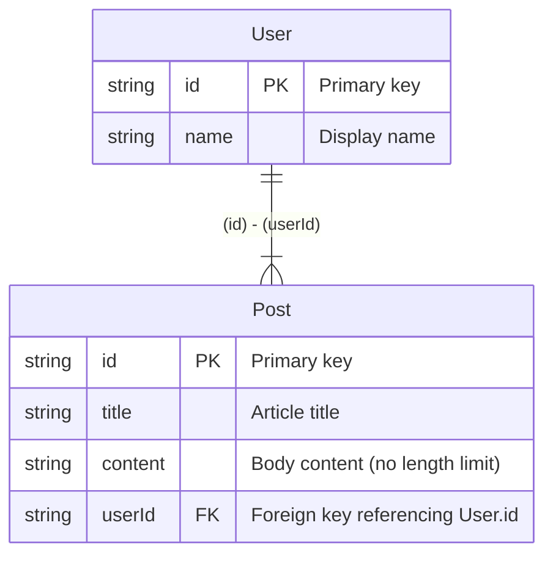

# Hekireki

**[Hekireki](https://www.npmjs.com/package/hekireki)** is a tool that generates validation schemas for Zod, Valibot, ArkType, and Effect Schema, as well as ER diagrams, from [Prisma](https://www.prisma.io/) schemas annotated with comments.

## Features

- 💎 Automatically generates [Zod](https://zod.dev/) schemas from your Prisma schema
- 🤖 Automatically generates [Valibot](https://valibot.dev/) schemas from your Prisma schema
- 🏹 Automatically generates [ArkType](https://arktype.io/) schemas from your Prisma schema
- ⚡ Automatically generates [Effect Schema](https://effect.website/docs/schema/introduction/) from your Prisma schema
- 📊 Creates [Mermaid](https://mermaid.js.org/) ER diagrams with PK/FK markers
- 📝 Generates [DBML](https://dbml.dbdiagram.io/) (Database Markup Language) files
- 🖼️ Outputs ER diagrams as **PNG/SVG** images using [dbml-renderer](https://github.com/softwaretechnik-berlin/dbml-renderer)
- 🧪 Generates [Ecto](https://hexdocs.pm/ecto/Ecto.Schema.html) schemas for Elixir projects
  ⚠️ Foreign key constraints are **not** included — manage relationships in your application logic

## Installation

```bash
npm install -D hekireki
```

## Usage

Prepare `schema.prisma`:

```prisma
datasource db {
    provider = "sqlite"
}

generator Hekireki-ER {
    provider = "hekireki-mermaid-er"
}

generator Hekireki-Zod {
    provider = "hekireki-zod"
    type     = true
    comment  = true
    relation = true
}

generator Hekireki-Valibot {
    provider = "hekireki-valibot"
    type     = true
    comment  = true
    relation = true
}

generator Hekireki-ArkType {
    provider = "hekireki-arktype"
    type     = true
    comment  = true
}

generator Hekireki-Effect {
    provider = "hekireki-effect"
    type     = true
    comment  = true
}

generator Hekireki-Ecto {
    provider = "hekireki-ecto"
    output = "schema"
    app = "DBSchema"
}

generator Hekireki-DBML {
    provider = "hekireki-dbml"
}

generator Hekireki-SVG {
    provider = "hekireki-svg"
    output   = "docs"
    format   = "png"
}

model User {
    /// Primary key
    /// @z.uuid()
    /// @v.pipe(v.string(), v.uuid())
    /// @a."string.uuid"
    /// @e.Schema.UUID
    id    String @id @default(uuid())
    /// Display name
    /// @z.string().min(1).max(50)
    /// @v.pipe(v.string(), v.minLength(1), v.maxLength(50))
    /// @a."1 <= string <= 50"
    /// @e.Schema.String.pipe(Schema.minLength(1), Schema.maxLength(50))
    name  String
    /// One-to-many relation to Post
    posts Post[]
}

model Post {
    /// Primary key
    /// @z.uuid()
    /// @v.pipe(v.string(), v.uuid())
    /// @a."string.uuid"
    /// @e.Schema.UUID
    id String @id @default(uuid())
    /// Article title
    /// @z.string().min(1).max(100)
    /// @v.pipe(v.string(), v.minLength(1), v.maxLength(100))
    /// @a."1 <= string <= 100"
    /// @e.Schema.String.pipe(Schema.minLength(1), Schema.maxLength(100))
    title String
    /// Body content (no length limit)
    /// @z.string()
    /// @v.string()
    /// @a."string"
    /// @e.Schema.String
    content String
    /// Foreign key referencing User.id
    /// @z.uuid()
    /// @v.pipe(v.string(), v.uuid())
    /// @a."string.uuid"
    /// @e.Schema.UUID
    userId  String
    /// Prisma relation definition
    user    User   @relation(fields: [userId], references: [id])
}
```

## Generate

## Zod

```ts
import * as z from 'zod'

export const UserSchema = z.object({
  /**
   * Primary key
   */
  id: z.uuid(),
  /**
   * Display name
   */
  name: z.string().min(1).max(50),
})

export type User = z.infer<typeof UserSchema>

export const PostSchema = z.object({
  /**
   * Primary key
   */
  id: z.uuid(),
  /**
   * Article title
   */
  title: z.string().min(1).max(100),
  /**
   * Body content (no length limit)
   */
  content: z.string(),
  /**
   * Foreign key referencing User.id
   */
  userId: z.uuid(),
})

export type Post = z.infer<typeof PostSchema>

export const UserRelationsSchema = z.object({
  ...UserSchema.shape,
  posts: z.array(PostSchema),
})

export type UserRelations = z.infer<typeof UserRelationsSchema>

export const PostRelationsSchema = z.object({
  ...PostSchema.shape,
  user: UserSchema,
})

export type PostRelations = z.infer<typeof PostRelationsSchema>
```

## Valibot

```ts
import * as v from 'valibot'

export const UserSchema = v.object({
  /**
   * Primary key
   */
  id: v.pipe(v.string(), v.uuid()),
  /**
   * Display name
   */
  name: v.pipe(v.string(), v.minLength(1), v.maxLength(50)),
})

export type User = v.InferInput<typeof UserSchema>

export const PostSchema = v.object({
  /**
   * Primary key
   */
  id: v.pipe(v.string(), v.uuid()),
  /**
   * Article title
   */
  title: v.pipe(v.string(), v.minLength(1), v.maxLength(100)),
  /**
   * Body content (no length limit)
   */
  content: v.string(),
  /**
   * Foreign key referencing User.id
   */
  userId: v.pipe(v.string(), v.uuid()),
})

export type Post = v.InferInput<typeof PostSchema>

export const UserRelationsSchema = v.object({
  ...UserSchema.entries,
  posts: v.array(PostSchema),
})

export type UserRelations = v.InferInput<typeof UserRelationsSchema>

export const PostRelationsSchema = v.object({
  ...PostSchema.entries,
  user: UserSchema,
})

export type PostRelations = v.InferInput<typeof PostRelationsSchema>
```

## ArkType

```ts
import { type } from 'arktype'

export const UserSchema = type({
  /** Primary key */
  id: 'string.uuid',
  /** Display name */
  name: '1 <= string <= 50',
})

export type User = typeof UserSchema.infer

export const PostSchema = type({
  /** Primary key */
  id: 'string.uuid',
  /** Article title */
  title: '1 <= string <= 100',
  /** Body content (no length limit) */
  content: 'string',
  /** Foreign key referencing User.id */
  userId: 'string.uuid',
})

export type Post = typeof PostSchema.infer
```

## Effect Schema

```ts
import { Schema } from 'effect'

export const UserSchema = Schema.Struct({
  /** Primary key */
  id: Schema.UUID,
  /** Display name */
  name: Schema.String.pipe(Schema.minLength(1), Schema.maxLength(50)),
})

export type User = Schema.Schema.Type<typeof UserSchema>

export const PostSchema = Schema.Struct({
  /** Primary key */
  id: Schema.UUID,
  /** Article title */
  title: Schema.String.pipe(Schema.minLength(1), Schema.maxLength(100)),
  /** Body content (no length limit) */
  content: Schema.String,
  /** Foreign key referencing User.id */
  userId: Schema.UUID,
})

export type Post = Schema.Schema.Type<typeof PostSchema>
```

## Mermaid



## Ecto

```elixir
defmodule DBSchema.User do
  use Ecto.Schema

  @primary_key {:id, :binary_id, autogenerate: true}

  @type t :: %__MODULE__{
          id: Ecto.UUID.t(),
          name: String.t()
        }

  schema "user" do
    field(:name, :string)
  end
end
```

```elixir
defmodule DBSchema.Post do
  use Ecto.Schema

  @primary_key {:id, :binary_id, autogenerate: true}

  @type t :: %__MODULE__{
          id: Ecto.UUID.t(),
          title: String.t(),
          content: String.t(),
          userId: String.t()
        }

  schema "post" do
    field(:title, :string)
    field(:content, :string)
    field(:userId, :string)
  end
end
```

## DBML

```dbml
Table User {
  id String [pk, note: 'Primary key']
  name String [not null, note: 'Display name']
  posts Post [not null, note: 'One-to-many relation to Post']
}

Table Post {
  id String [pk, note: 'Primary key']
  title String [not null, note: 'Article title']
  content String [not null, note: 'Body content (no length limit)']
  userId String [not null, note: 'Foreign key referencing User.id']
  user User [not null, note: 'Prisma relation definition']
}

Ref Post_userId_fk: Post.userId > User.id
```

## PNG/SVG

The `hekireki-svg` generator outputs ER diagrams as PNG or SVG images using [dbml-renderer](https://github.com/softwaretechnik-berlin/dbml-renderer).

Output: `docs/er-diagram.png`

## Configuration

Configure each generator directly in your `schema.prisma` file:

```prisma
// Zod Generator
generator Hekireki-Zod {
    provider = "hekireki-zod"
    output   = "./zod"       // Output directory (default: ./zod)
    file     = "index.ts"    // File name (default: index.ts)
    type     = true          // Generate TypeScript types (default: false)
    comment  = true          // Include schema documentation (default: false)
    zod      = "v4"          // Zod import: "v4", "mini", or "@hono/zod-openapi" (default: v4)
    relation = true          // Generate relation schemas (default: false)
}

// Valibot Generator
generator Hekireki-Valibot {
    provider = "hekireki-valibot"
    output   = "./valibot"   // Output directory (default: ./valibot)
    file     = "index.ts"    // File name (default: index.ts)
    type     = true          // Generate TypeScript types (default: false)
    comment  = true          // Include schema documentation (default: false)
    relation = true          // Generate relation schemas (default: false)
}

// ArkType Generator
generator Hekireki-ArkType {
    provider = "hekireki-arktype"
    output   = "./arktype"   // Output directory (default: ./arktype)
    file     = "index.ts"    // File name (default: index.ts)
    type     = true          // Generate TypeScript types (default: false)
    comment  = true          // Include schema documentation (default: false)
}

// Effect Schema Generator
generator Hekireki-Effect {
    provider = "hekireki-effect"
    output   = "./effect"    // Output directory (default: ./effect)
    file     = "index.ts"    // File name (default: index.ts)
    type     = true          // Generate TypeScript types (default: false)
    comment  = true          // Include schema documentation (default: false)
}

// Mermaid ER Generator
generator Hekireki-ER {
    provider = "hekireki-mermaid-er"
    output   = "./mermaid-er" // Output directory (default: ./mermaid-er)
    file     = "ER.md"        // File name (default: ER.md)
}

// Ecto Generator
generator Hekireki-Ecto {
    provider = "hekireki-ecto"
    output   = "./ecto"      // Output directory (default: ./ecto)
    app      = "MyApp"       // App name (default: MyApp)
}

// DBML Generator
generator Hekireki-DBML {
    provider = "hekireki-dbml"
    output   = "./dbml"      // Output directory (default: ./dbml)
    file     = "schema.dbml" // File name (default: schema.dbml)
}

// SVG/PNG Generator
generator Hekireki-SVG {
    provider = "hekireki-svg"
    output   = "./docs"      // Output directory (default: ./docs)
    file     = "er-diagram"  // File name without extension (default: er-diagram)
    format   = "png"         // Output format: "png", "svg", or "dot" (default: png)
}
```

## License

Distributed under the MIT License. See [LICENSE](https://github.com/nakita628/hekireki?tab=MIT-1-ov-file) for more information.
