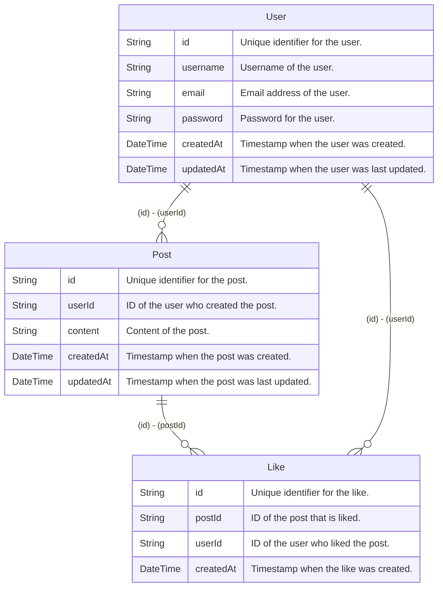

# Hekireki

[Hekireki](https://github.com/nakita628/hekireki) is a tool that generates validation schemas for Zod and Valibot, as well as ER diagrams, from [Prisma](https://www.prisma.io/) schemas annotated with comments.

## Features

- 💎 Automatically generates [Zod](https://zod.dev/) schemas from your Prisma schema
- 🤖 Automatically generates [Valibot](https://valibot.dev/) schemas from your Prisma schema
- 📊 Creates [Mermaid](https://mermaid.js.org/) ER diagrams

## Installation

```bash
npm install -D hekireki
```

## Usage

Prepare `schema.prisma`:

```prisma
generator client {
  provider = "prisma-client-js"
}

datasource db {
  provider = "sqlite"
  url      = env("DATABASE_URL")
}

generator Hekireki-ER {
  provider = "hekireki-mermaid-er"
}

generator Hekireki-Zod {
  provider = "hekireki-zod"
  type     = true
  comment  = true
}

generator Hekireki-Valibot {
  provider = "hekireki-valibot"
  type     = true
  comment  = true
}

model User {
  /// Unique identifier for the user.
  /// @z.string().uuid()
  /// @v.pipe(v.string(), v.uuid())
  id String @id @default(uuid())
  /// Username of the user.
  /// @z.string().min(3)
  /// @v.pipe(v.string(), v.minLength(3))
  username String
  /// Email address of the user.
  /// @z.string().email()
  /// @v.pipe(v.string(), v.email())
  email String
  /// Password for the user.
  /// @z.string().min(8).max(100)
  /// @v.pipe(v.string(), v.minLength(8), v.maxLength(100))
  password String
  /// Timestamp when the user was created.
  /// @z.date()
  /// @v.date()
  createdAt DateTime
  /// Timestamp when the user was last updated.
  /// @z.date()
  /// @v.date()
  updatedAt DateTime
  posts Post[]
  likes Like[]
}

/// @relation User.id Post.userId one-to-many
model Post {
  /// Unique identifier for the post.
  /// @z.string().uuid()
  /// @v.pipe(v.string(), v.uuid())
  id String @id @default(uuid())
  /// ID of the user who created the post.
  /// @z.string().uuid()
  /// @v.pipe(v.string(), v.uuid())
  userId String
  /// Content of the post.
  /// @z.string().max(500)
  /// @v.pipe(v.string(), v.maxLength(500))
  content String
  /// Timestamp when the post was created.
  /// @z.date()
  /// @v.date()
  createdAt DateTime @default(now())
  /// Timestamp when the post was last updated.
  /// @z.date()
  /// @v.date()
  updatedAt DateTime @default(now()) @updatedAt
  /// Relation with the User model.
  user User @relation(fields: [userId], references: [id], onDelete: Cascade)
  likes Like[]
}

/// @relation Post.id Like.postId one-to-many
/// @relation User.id Like.userId one-to-many
model Like {
  /// Unique identifier for the like.
  /// @z.string().uuid()
  /// @v.pipe(v.string(), v.uuid())
  id String
  /// ID of the post that is liked.
  /// @z.string().uuid()
  /// @v.pipe(v.string(), v.uuid())
  postId String
  /// ID of the user who liked the post.
  /// @z.string().uuid()
  /// @v.pipe(v.string(), v.uuid())
  userId String
  /// Timestamp when the like was created.
  /// @z.date()
  /// @v.date()
  createdAt DateTime @default(now())
  /// Relation with the Post model.
  post Post @relation(fields: [postId], references: [id], onDelete: Cascade)
  /// Relation with the User model.
  user User @relation(fields: [userId], references: [id], onDelete: Cascade)
  @@unique([userId, postId])
}
```

## Generate

### Zod

```ts
import { z } from 'zod'

export const UserSchema = z.object({
  /**
   * Unique identifier for the user.
   */
  id: z.string().uuid(),
  /**
   * Username of the user.
   */
  username: z.string().min(3),
  /**
   * Email address of the user.
   */
  email: z.string().email(),
  /**
   * Password for the user.
   */
  password: z.string().min(8).max(100),
  /**
   * Timestamp when the user was created.
   */
  createdAt: z.date(),
  /**
   * Timestamp when the user was last updated.
   */
  updatedAt: z.date(),
})

export type User = z.infer<typeof UserSchema>

export const PostSchema = z.object({
  /**
   * Unique identifier for the post.
   */
  id: z.string().uuid(),
  /**
   * ID of the user who created the post.
   */
  userId: z.string().uuid(),
  /**
   * Content of the post.
   */
  content: z.string().max(500),
  /**
   * Timestamp when the post was created.
   */
  createdAt: z.date(),
  /**
   * Timestamp when the post was last updated.
   */
  updatedAt: z.date(),
})

export type Post = z.infer<typeof PostSchema>

export const LikeSchema = z.object({
  /**
   * Unique identifier for the like.
   */
  id: z.string().uuid(),
  /**
   * ID of the post that is liked.
   */
  postId: z.string().uuid(),
  /**
   * ID of the user who liked the post.
   */
  userId: z.string().uuid(),
  /**
   * Timestamp when the like was created.
   */
  createdAt: z.date(),
})

export type Like = z.infer<typeof LikeSchema>
```

## Valibot
```ts
import * as v from 'valibot'

export const UserSchema = v.object({
  /**
   * Unique identifier for the user.
   */
  id: v.pipe(v.string(), v.uuid()),
  /**
   * Username of the user.
   */
  username: v.pipe(v.string(), v.minLength(3)),
  /**
   * Email address of the user.
   */
  email: v.pipe(v.string(), v.email()),
  /**
   * Password for the user.
   */
  password: v.pipe(v.string(), v.minLength(8), v.maxLength(100)),
  /**
   * Timestamp when the user was created.
   */
  createdAt: v.date(),
  /**
   * Timestamp when the user was last updated.
   */
  updatedAt: v.date(),
})

export type User = v.InferInput<typeof UserSchema>

export const PostSchema = v.object({
  /**
   * Unique identifier for the post.
   */
  id: v.pipe(v.string(), v.uuid()),
  /**
   * ID of the user who created the post.
   */
  userId: v.pipe(v.string(), v.uuid()),
  /**
   * Content of the post.
   */
  content: v.pipe(v.string(), v.maxLength(500)),
  /**
   * Timestamp when the post was created.
   */
  createdAt: v.date(),
  /**
   * Timestamp when the post was last updated.
   */
  updatedAt: v.date(),
})

export type Post = v.InferInput<typeof PostSchema>

export const LikeSchema = v.object({
  /**
   * Unique identifier for the like.
   */
  id: v.pipe(v.string(), v.uuid()),
  /**
   * ID of the post that is liked.
   */
  postId: v.pipe(v.string(), v.uuid()),
  /**
   * ID of the user who liked the post.
   */
  userId: v.pipe(v.string(), v.uuid()),
  /**
   * Timestamp when the like was created.
   */
  createdAt: v.date(),
})

export type Like = v.InferInput<typeof LikeSchema>
```

## Mermaid



## Configuration

### Zod Generator Options

| Option       | Type      | Default                             | Description                                      |
|--------------|-----------|-------------------------------------|--------------------------------------------------|
| `output`     | `string`  | `./zod`                             | Output directory                                 |
| `file`       | `string`  | `index.ts`                          | File Name                                        |
| `schemaName` | `"PascalCase"` \| `"camelCase"` | `"PascalCase"`| Naming convention for generated schema variables |
| `typeName`   | `"PascalCase"` \| `"camelCase"` | `"PascalCase"`| Naming convention for generated type definitions |
| `type`       | `boolean` | `false`                             | Generate TypeScript types                        |
| `comment`    | `boolean` | `false`                             | Include schema documentation                     |

### Valibot Generator Options

| Option       | Type      | Default                             | Description                                      |
|--------------|-----------|-------------------------------------|--------------------------------------------------|
| `output`     | `string`  | `./valibot`                          | Output directory                                 |
| `file`       | `string`  | `index.ts`                          | File Name                                        |
| `schemaName` | `"PascalCase"` \| `"camelCase"` | `"PascalCase"`| Naming convention for generated schema variables |
| `typeName`   | `"PascalCase"` \| `"camelCase"` | `"PascalCase"`| Naming convention for generated type definitions |
| `type`       | `boolean` | `false`                             | Generate TypeScript types                        |
| `comment`    | `boolean` | `false`                             | Include schema documentation                     |

### Mermaid ER Generator Options

| Option       | Type      | Default                             | Description                                      |
|--------------|-----------|-------------------------------------|--------------------------------------------------|
| `output`     | `string`  | `./mermaid-er`                      | Output directory                                 |
| `file`       | `string`  | `ER.md`                             | File Name                                        |

⚠️ WARNING: Potential Breaking Changes Without Notice

This project is in **early development** and being maintained by a developer with about 2 years of experience. While I'm doing my best to create a useful tool:


## License

Distributed under the MIT License. See [LICENSE](https://github.com/nakita628/hekireki?tab=MIT-1-ov-file) for more information.