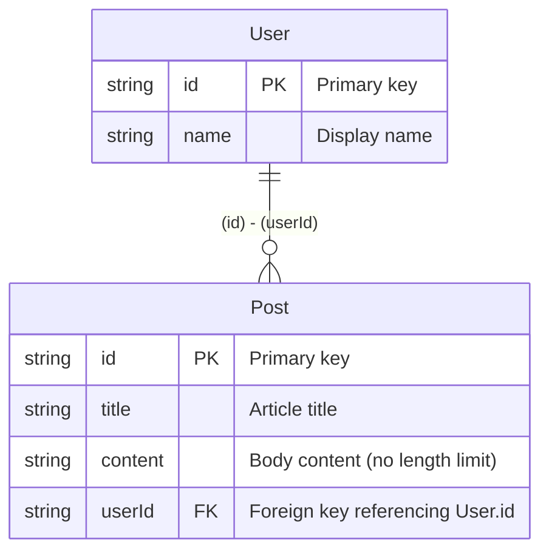

# Hekireki

**[Hekireki](https://www.npmjs.com/package/hekireki)** is a tool that generates validation schemas, ORM models, and ER diagrams from [Prisma](https://www.prisma.io/) schemas — supporting TypeScript, Python, Go, Rust, Elixir, Ruby, and PHP.

## Features

### TypeScript Validation Libraries

- 💎 Automatically generates [Zod](https://zod.dev/) schemas from your Prisma schema
- 🤖 Automatically generates [Valibot](https://valibot.dev/) schemas from your Prisma schema
- 🏹 Automatically generates [ArkType](https://arktype.io/) schemas from your Prisma schema
- ⚡ Automatically generates [Effect Schema](https://effect.website/docs/schema/introduction/) from your Prisma schema
- 📦 Automatically generates [TypeBox](https://github.com/sinclairzx81/typebox) schemas from your Prisma schema
- 📋 Automatically generates [AJV](https://ajv.js.org/)-compatible JSON Schema objects from your Prisma schema

### Python Validation

- 🐍 Automatically generates [Pydantic](https://docs.pydantic.dev/) v2 models from your Prisma schema — with `@p.` field annotations, `Literal` enums, `@p.ConfigDict(...)` model config passthrough (`extra='forbid'` / `'ignore'` / `'allow'` and any other `ConfigDict` arguments), and `relation = true` for `<Model>Relations` subclasses

### ORM / Schema Generation (Multi-Language)

- 🗄️ Automatically generates [Drizzle ORM](https://orm.drizzle.team/) table schemas and relations from your Prisma schema
- 🐟 Automatically generates [Kysely](https://kysely.dev/) type definitions (`DB` interface) from your Prisma schema — with database-side-only `Generated` columns, enum value unions, `@map`/`@@map` support, and implicit m2m join tables
- 🐍 Automatically generates [SQLAlchemy](https://www.sqlalchemy.org/) models (Python) — with `Mapped[T]` type hints, relationships, enums, composite keys, and index support
- 🎸 Automatically generates [Django ORM](https://www.djangoproject.com/) models (Python, Django ≥ 5.2) — with `ForeignKey` / `OneToOneField` / `ManyToManyField` relations (`related_name` from the Prisma back-relation), `TextChoices` enums, composite primary keys (`CompositePrimaryKey`), migration-serializable defaults, `db_default` for `now()` / `dbgenerated(...)`, and `Meta` constraints / indexes
- 🐹 Automatically generates [GORM](https://gorm.io/) models (Go) — with struct tags, JSON tags, relationships, enums, composite keys, and index support
- 🦀 Automatically generates [Sea-ORM](https://www.sea-ql.org/SeaORM/) entities (Rust) — with `DeriveEntityModel`, relations, enums, serde support, and `rename_all`
- 🧪 Generates [Ecto](https://hexdocs.pm/ecto/Ecto.Schema.html) schemas (Elixir) — with associations (`belongs_to`, `has_many`, `has_one`), composite primary keys, `@type t` typespecs, array fields, `@@map`/`@map` support, and `@moduledoc`
- 💎 Generates [Active Record](https://guides.rubyonrails.org/active_record_basics.html) models (Ruby on Rails) — with associations (`belongs_to`, `has_one`, `has_many`, `has_and_belongs_to_many`), enums, composite primary keys, and `@@map`/`@map` support
- 🐘 Generates [Eloquent](https://laravel.com/docs/eloquent) models (Laravel / PHP) — with relations (`belongsTo`, `hasOne`, `hasMany`, `belongsToMany`), `$fillable`, `$casts`, string-backed PHP enums, timestamp constants, and `@@map`/`@map` support
- 🌍 Generates [Atlas](https://atlasgo.io/) HCL database schemas — with native `@db.*` type mapping (PostgreSQL / MySQL / SQLite), enum blocks, defaults (including `dbgenerated(...)` and scalar-list defaults), foreign keys with Prisma's referential-action defaults, unique / descending / fulltext indexes, implicit m2m join tables, and `@@schema` support — output is `atlas schema fmt` canonical

### Diagrams & Documentation

- 📊 Draws the ER model of the schema in whichever of four formats the `output` extension names: [Mermaid](https://mermaid.js.org/) (`.md`), [DBML](https://dbml.dbdiagram.io/) (`.dbml`), or a **PNG / SVG** drawn the way Hekireki Studio shows it — crow's-foot cardinality read from the schema, `PK` / `FK` / `UK` markers and implicit many-to-many relations throughout

## Installation

```bash
npm install -D hekireki
```

## Usage

Prepare `schema.prisma`:

```prisma
datasource db {
    provider = "sqlite"
}

generator Hekireki-Zod {
    provider = "hekireki-zod"
    output   = "./zod"
    type     = true
    comment  = true
    relation = true
}

generator Hekireki-Valibot {
    provider = "hekireki-valibot"
    output   = "./valibot"
    type     = true
    comment  = true
    relation = true
}

generator Hekireki-ArkType {
    provider = "hekireki-arktype"
    output   = "./arktype"
    type     = true
    comment  = true
    relation = true
}

generator Hekireki-Effect {
    provider = "hekireki-effect"
    output   = "./effect"
    type     = true
    comment  = true
    relation = true
}

generator Hekireki-TypeBox {
    provider = "hekireki-typebox"
    output   = "./typebox"
    type     = true
    comment  = true
    relation = true
}

generator Hekireki-AJV {
    provider = "hekireki-ajv"
    output   = "./ajv"
    type     = true
    comment  = true
    relation = true
}

generator Hekireki-Pydantic {
    provider = "hekireki-pydantic"
    output   = "./pydantic"
    comment  = true
}

generator Hekireki-Drizzle {
    provider = "hekireki-drizzle"
    output   = "./drizzle"
}

generator Hekireki-Kysely {
    provider = "hekireki-kysely"
    output   = "./kysely"
}

generator Hekireki-Atlas {
    provider = "hekireki-atlas"
    output   = "./atlas"
}

generator Hekireki-SQLAlchemy {
    provider = "hekireki-sqlalchemy"
    output   = "./sqlalchemy"
}

generator Hekireki-Django {
    provider = "hekireki-django"
    output   = "./django"
}

generator Hekireki-GORM {
    provider = "hekireki-gorm"
    output   = "./gorm"
    package  = "model"
}

generator Hekireki-SeaORM {
    provider   = "hekireki-sea-orm"
    output     = "./sea_orm"
    renameAll  = "camelCase"
}

generator Hekireki-Ecto {
    provider = "hekireki-ecto"
    output = "./ecto"
    app = "DBSchema"
}

generator Hekireki-ActiveRecord {
    provider = "hekireki-activerecord"
    output   = "./activerecord"
}

generator Hekireki-Eloquent {
    provider  = "hekireki-eloquent"
    output    = "./eloquent"
    namespace = "App.Models"
}

generator Hekireki-ER {
    provider = "hekireki-er"
    output   = "docs/schema.dbml"
}

generator Hekireki-Docs {
    provider = "hekireki-docs"
    output   = "./docs"
}

model User {
    /// Primary key
    /// @z.uuid()
    /// @v.pipe(v.string(), v.uuid())
    /// @a."string.uuid"
    /// @e.Schema.UUID
    /// @t.Type.String({ format: 'uuid' })
    /// @j.{ type: 'string' as const, format: 'uuid' as const }
    /// @p.UUID4
    id    String @id @default(uuid())
    /// Display name
    /// @z.string().min(1).max(50)
    /// @v.pipe(v.string(), v.minLength(1), v.maxLength(50))
    /// @a."1 <= string <= 50"
    /// @e.Schema.String.pipe(Schema.minLength(1), Schema.maxLength(50))
    /// @t.Type.String({ minLength: 1, maxLength: 50 })
    /// @j.{ type: 'string' as const, minLength: 1, maxLength: 50 }
    /// @p.Annotated[str, StringConstraints(min_length=1, max_length=50)]
    name  String
    /// One-to-many relation to Post
    posts Post[]
}

model Post {
    /// Primary key
    /// @z.uuid()
    /// @v.pipe(v.string(), v.uuid())
    /// @a."string.uuid"
    /// @e.Schema.UUID
    /// @t.Type.String({ format: 'uuid' })
    /// @j.{ type: 'string' as const, format: 'uuid' as const }
    /// @p.UUID4
    id String @id @default(uuid())
    /// Article title
    /// @z.string().min(1).max(100)
    /// @v.pipe(v.string(), v.minLength(1), v.maxLength(100))
    /// @a."1 <= string <= 100"
    /// @e.Schema.String.pipe(Schema.minLength(1), Schema.maxLength(100))
    /// @t.Type.String({ minLength: 1, maxLength: 100 })
    /// @j.{ type: 'string' as const, minLength: 1, maxLength: 100 }
    /// @p.Annotated[str, StringConstraints(min_length=1, max_length=100)]
    title String
    /// Body content (no length limit)
    /// @z.string()
    /// @v.string()
    /// @a."string"
    /// @e.Schema.String
    /// @t.Type.String()
    /// @j.{ type: 'string' as const }
    content String
    /// Foreign key referencing User.id
    /// @z.uuid()
    /// @v.pipe(v.string(), v.uuid())
    /// @a."string.uuid"
    /// @e.Schema.UUID
    /// @t.Type.String({ format: 'uuid' })
    /// @j.{ type: 'string' as const, format: 'uuid' as const }
    /// @p.UUID4
    userId  String
    /// Prisma relation definition
    user    User   @relation(fields: [userId], references: [id])
}
```

## Generated Output

### Zod

```ts
import * as z from 'zod'

export const UserSchema = z.object({
  /**
   * Primary key
   */
  id: z.uuid(),
  /**
   * Display name
   */
  name: z.string().min(1).max(50),
})

export type User = z.infer<typeof UserSchema>

export const PostSchema = z.object({
  /**
   * Primary key
   */
  id: z.uuid(),
  /**
   * Article title
   */
  title: z.string().min(1).max(100),
  /**
   * Body content (no length limit)
   */
  content: z.string(),
  /**
   * Foreign key referencing User.id
   */
  userId: z.uuid(),
})

export type Post = z.infer<typeof PostSchema>

export const UserRelationsSchema = z.object({
  ...UserSchema.shape,
  posts: z.array(PostSchema),
})

export type UserRelations = z.infer<typeof UserRelationsSchema>

export const PostRelationsSchema = z.object({
  ...PostSchema.shape,
  user: UserSchema,
})

export type PostRelations = z.infer<typeof PostRelationsSchema>
```

### Valibot

```ts
import * as v from 'valibot'

export const UserSchema = v.object({
  /**
   * Primary key
   */
  id: v.pipe(v.string(), v.uuid()),
  /**
   * Display name
   */
  name: v.pipe(v.string(), v.minLength(1), v.maxLength(50)),
})

export type User = v.InferOutput<typeof UserSchema>

export const PostSchema = v.object({
  /**
   * Primary key
   */
  id: v.pipe(v.string(), v.uuid()),
  /**
   * Article title
   */
  title: v.pipe(v.string(), v.minLength(1), v.maxLength(100)),
  /**
   * Body content (no length limit)
   */
  content: v.string(),
  /**
   * Foreign key referencing User.id
   */
  userId: v.pipe(v.string(), v.uuid()),
})

export type Post = v.InferOutput<typeof PostSchema>

export const UserRelationsSchema = v.object({
  ...UserSchema.entries,
  posts: v.array(PostSchema),
})

export type UserRelations = v.InferOutput<typeof UserRelationsSchema>

export const PostRelationsSchema = v.object({
  ...PostSchema.entries,
  user: UserSchema,
})

export type PostRelations = v.InferOutput<typeof PostRelationsSchema>
```

### ArkType

```ts
import { type } from 'arktype'

export const UserSchema = type({
  /**
   * Primary key
   */
  id: 'string.uuid',
  /**
   * Display name
   */
  name: '1 <= string <= 50',
})

export type User = typeof UserSchema.infer

export const PostSchema = type({
  /**
   * Primary key
   */
  id: 'string.uuid',
  /**
   * Article title
   */
  title: '1 <= string <= 100',
  /**
   * Body content (no length limit)
   */
  content: 'string',
  /**
   * Foreign key referencing User.id
   */
  userId: 'string.uuid',
})

export type Post = typeof PostSchema.infer

export const UserRelationsSchema = type({ ...UserSchema.t, posts: PostSchema.array() })

export type UserRelations = typeof UserRelationsSchema.infer

export const PostRelationsSchema = type({ ...PostSchema.t, user: UserSchema })

export type PostRelations = typeof PostRelationsSchema.infer
```

### Effect Schema

```ts
import { Schema } from 'effect'

export const UserSchema = Schema.Struct({
  /**
   * Primary key
   */
  id: Schema.UUID,
  /**
   * Display name
   */
  name: Schema.String.pipe(Schema.minLength(1), Schema.maxLength(50)),
})

export type User = typeof UserSchema.Type

export const PostSchema = Schema.Struct({
  /**
   * Primary key
   */
  id: Schema.UUID,
  /**
   * Article title
   */
  title: Schema.String.pipe(Schema.minLength(1), Schema.maxLength(100)),
  /**
   * Body content (no length limit)
   */
  content: Schema.String,
  /**
   * Foreign key referencing User.id
   */
  userId: Schema.UUID,
})

export type Post = typeof PostSchema.Type

export const UserRelationsSchema = Schema.Struct({
  ...UserSchema.fields,
  posts: Schema.Array(PostSchema),
})

export type UserRelations = typeof UserRelationsSchema.Type

export const PostRelationsSchema = Schema.Struct({ ...PostSchema.fields, user: UserSchema })

export type PostRelations = typeof PostRelationsSchema.Type
```

### TypeBox

```ts
import { type Static, Type } from '@sinclair/typebox'

export const UserSchema = Type.Object({
  /**
   * Primary key
   */
  id: Type.String({ format: 'uuid' }),
  /**
   * Display name
   */
  name: Type.String({ minLength: 1, maxLength: 50 }),
})

export type User = Static<typeof UserSchema>

export const PostSchema = Type.Object({
  /**
   * Primary key
   */
  id: Type.String({ format: 'uuid' }),
  /**
   * Article title
   */
  title: Type.String({ minLength: 1, maxLength: 100 }),
  /**
   * Body content (no length limit)
   */
  content: Type.String(),
  /**
   * Foreign key referencing User.id
   */
  userId: Type.String({ format: 'uuid' }),
})

export type Post = Static<typeof PostSchema>

export const UserRelationsSchema = Type.Object({
  ...UserSchema.properties,
  posts: Type.Array(PostSchema),
})

export type UserRelations = Static<typeof UserRelationsSchema>

export const PostRelationsSchema = Type.Object({
  ...PostSchema.properties,
  user: UserSchema,
})

export type PostRelations = Static<typeof PostRelationsSchema>
```

### AJV

```ts
import type { FromSchema } from 'json-schema-to-ts'

export const UserSchema = {
  type: 'object' as const,
  properties: {
    /**
     * Primary key
     */
    id: { type: 'string' as const, format: 'uuid' as const },
    /**
     * Display name
     */
    name: { type: 'string' as const, minLength: 1, maxLength: 50 },
  },
  required: ['id', 'name'] as const,
  additionalProperties: false,
} as const

export type User = FromSchema<typeof UserSchema>

export const PostSchema = {
  type: 'object' as const,
  properties: {
    /**
     * Primary key
     */
    id: { type: 'string' as const, format: 'uuid' as const },
    /**
     * Article title
     */
    title: { type: 'string' as const, minLength: 1, maxLength: 100 },
    /**
     * Body content (no length limit)
     */
    content: { type: 'string' as const },
    /**
     * Foreign key referencing User.id
     */
    userId: { type: 'string' as const, format: 'uuid' as const },
  },
  required: ['id', 'title', 'content', 'userId'] as const,
  additionalProperties: false,
} as const

export type Post = FromSchema<typeof PostSchema>

export const UserRelationsSchema = {
  type: 'object' as const,
  properties: {
    ...UserSchema.properties,
    posts: { type: 'array' as const, items: PostSchema },
  },
  additionalProperties: false,
} as const

export type UserRelations = FromSchema<typeof UserRelationsSchema>

export const PostRelationsSchema = {
  type: 'object' as const,
  properties: {
    ...PostSchema.properties,
    user: UserSchema,
  },
  additionalProperties: false,
} as const

export type PostRelations = FromSchema<typeof PostRelationsSchema>
```

### Drizzle

```ts
import { sqliteTable, text } from 'drizzle-orm/sqlite-core'
import { relations } from 'drizzle-orm'

export const user = sqliteTable('user', {
  id: text('id')
    .primaryKey()
    .$defaultFn(() => crypto.randomUUID()),
  name: text('name').notNull(),
})

export const post = sqliteTable('post', {
  id: text('id')
    .primaryKey()
    .$defaultFn(() => crypto.randomUUID()),
  title: text('title').notNull(),
  content: text('content').notNull(),
  userId: text('userId')
    .notNull()
    .references(() => user.id),
})

export const userRelations = relations(user, ({ many }) => ({ posts: many(post) }))

export const postRelations = relations(post, ({ one }) => ({
  user: one(user, { fields: [post.userId], references: [user.id] }),
}))
```

### Kysely

Pure type definitions for the [Kysely](https://kysely.dev/) query builder. The `DB` interface is keyed by the actual database table names (`@@map` respected), columns use `@map`-ped names, and enums become value unions of their `@map`-ped database values. Reach for Kysely's own `Selectable` / `Insertable` / `Updateable` wrappers when you need to name a row type; query results are inferred and need no annotation.

Only **database-side** defaults become `Generated<T>`. `autoincrement()`, `now()` and `dbgenerated(...)` are evaluated by the database, so they are optional on insert; `uuid()`, `cuid()`, `ulid()` and `nanoid()` are evaluated by the Prisma Client and leave the column without a DDL default, so a raw Kysely insert must still supply them.

```ts
export interface User {
  id: string
  name: string
}

export interface Post {
  id: string
  title: string
  content: string
  userId: string
}

export interface DB {
  User: User
  Post: Post
}
```

Both ids above are `@default(uuid())`, which Prisma evaluates in the client — hence plain `string`, required on insert. A database-side default instead emits `Generated<T>` (and, for `DateTime`, the `Timestamp` alias), which Kysely makes optional on insert:

```prisma
model Comment {
  id        Int      @id @default(autoincrement())
  createdAt DateTime @default(now())
}
```

```ts
import type { ColumnType } from 'kysely'

export type Generated<T> =
  T extends ColumnType<infer S, infer I, infer U>
    ? ColumnType<S, I | undefined, U>
    : ColumnType<T, T | undefined, T>

export type Timestamp = ColumnType<Date, Date | string, Date | string>

export interface Comment {
  id: Generated<number>
  createdAt: Generated<Timestamp>
}
```

```ts
import { Kysely, type Insertable } from 'kysely'
import type { DB, Post } from './kysely/types'

declare const db: Kysely<DB>
declare const userId: string

// Query results are inferred — no annotation needed.
const posts = await db.selectFrom('Post').selectAll().execute()

const draft: Insertable<Post> = {
  id: crypto.randomUUID(),
  title: 'Hello',
  content: '...',
  userId,
}
await db.insertInto('Post').values(draft).execute()
```

### Atlas

A declarative [Atlas](https://atlasgo.io/) HCL schema (`schema.hcl`). Table and column names use their `@@map`/`@map` database names, foreign keys and indexes follow Prisma's naming conventions (`<table>_<columns>_fkey` / `_key` / `_idx`), referential actions fall back to Prisma's defaults (`onUpdate: Cascade`, `onDelete: Restrict` for required and `SetNull` for optional relations), and client-side defaults such as `uuid()` and `cuid()` emit no database `DEFAULT` — the file describes exactly what `prisma migrate` would create. The output is already `atlas schema fmt` canonical.

The schema label defaults to `public` (PostgreSQL / MySQL) or `main` (SQLite); on MySQL, set `schemaName` to your database name since MySQL schemas are databases.

> [!WARNING]
> Declarative `atlas schema apply` drops whatever is missing from the HCL, and three things can never appear in it: Prisma's own `_prisma_migrations` table (exclude it with `--exclude '_prisma_migrations'`), and columns or tables marked `@ignore`/`@@ignore` or typed `Unsupported(...)` — Prisma omits those from the DMMF that hekireki reads. When applying to an existing database, always dry-run first and keep Atlas's destructive-change linting enabled.

Known limitations: the implicit m2m primary key is an unnamed constraint (Prisma names it `_X_AB_pkey`; the column set is identical, so this only surfaces as a constraint rename if you later hand the database back to `prisma migrate`), all enum blocks land in the default schema under `multiSchema` (Prisma exposes no schema for enums), Prisma's 63-byte truncation of very long constraint names is not reproduced, and removing or renaming enum values is a type rebuild in Atlas, as in any PostgreSQL workflow.

```hcl
table "User" {
  schema = schema.main
  column "id" {
    null = false
    type = text
  }
  column "name" {
    null = false
    type = text
  }
  primary_key {
    columns = [column.id]
  }
}

table "Post" {
  schema = schema.main
  column "id" {
    null = false
    type = text
  }
  column "title" {
    null = false
    type = text
  }
  column "content" {
    null = false
    type = text
  }
  column "userId" {
    null = false
    type = text
  }
  primary_key {
    columns = [column.id]
  }
  foreign_key "Post_userId_fkey" {
    columns     = [column.userId]
    ref_columns = [table.User.column.id]
    on_update   = CASCADE
    on_delete   = RESTRICT
  }
}

schema "main" {}
```

```bash
# Apply the schema declaratively (dry-run first), or diff versioned migrations from it
atlas schema apply --url "$DATABASE_URL" --to file://atlas/schema.hcl --exclude '_prisma_migrations' --dry-run
atlas schema apply --url "$DATABASE_URL" --to file://atlas/schema.hcl --exclude '_prisma_migrations'
atlas migrate diff --dev-url "docker://postgres/17/dev" --to file://atlas/schema.hcl
```

### Ecto

Each model is output as a separate `.ex` file (1 model = 1 file), following Elixir conventions.

```elixir
defmodule DBSchema.User do
  use Ecto.Schema
  @moduledoc false

  @primary_key {:id, :binary_id, autogenerate: true}
  @foreign_key_type :binary_id

  @type t :: %__MODULE__{
          id: Ecto.UUID.t(),
          name: String.t(),
          posts: [DBSchema.Post.t()]
        }

  schema "user" do
    field(:name, :string)
    has_many(:posts, DBSchema.Post, foreign_key: :user_id)
  end
end
```

```elixir
defmodule DBSchema.Post do
  use Ecto.Schema
  @moduledoc false

  @primary_key {:id, :binary_id, autogenerate: true}
  @foreign_key_type :binary_id

  @type t :: %__MODULE__{
          id: Ecto.UUID.t(),
          title: String.t(),
          content: String.t(),
          user: DBSchema.User.t() | nil
        }

  schema "post" do
    field(:title, :string)
    field(:content, :string)
    field(:user_id, :binary_id, source: :userId)
    belongs_to(:user, DBSchema.User, foreign_key: :user_id, define_field: false)
  end
end
```

### Active Record

Each model is output as a separate `.rb` file (1 model = 1 file), following Rails conventions. `class_name` and `foreign_key` are always spelled out so the generated associations never rely on Rails inflection. The generated code targets Rails 7.1+ (positional `enum` syntax, composite primary keys) and is continuously syntax-checked (`ruby -c`) and loaded against the real `activerecord` gem in CI.

```ruby
class User < ApplicationRecord
  self.table_name = "user"

  attribute :id, default: -> { SecureRandom.uuid }

  has_many :posts, class_name: "Post", foreign_key: "userId"
end
```

```ruby
class Post < ApplicationRecord
  self.table_name = "post"

  attribute :id, default: -> { SecureRandom.uuid }

  belongs_to :user, class_name: "User", foreign_key: "userId"
end
```

### Eloquent

Each model is output as a separate `.php` file (1 model = 1 file, PSR-4 friendly). Prisma enums become string-backed PHP enums with matching `$casts` entries. The generated code targets PHP 8.1+ (backed enums) and is continuously syntax-checked (`php -l`) and loaded against the real `illuminate/database` package in CI. Composite primary keys are emitted as `protected $primaryKey = null;` because Eloquent has no native composite key support.

```php
<?php

namespace App\Models;

use Illuminate\Database\Eloquent\Concerns\HasVersion4Uuids;
use Illuminate\Database\Eloquent\Model;
use Illuminate\Database\Eloquent\Relations\HasMany;

class User extends Model
{
    use HasVersion4Uuids;

    protected $table = 'user';

    protected $keyType = 'string';

    public $incrementing = false;

    public $timestamps = false;

    protected $fillable = [
        'name',
    ];

    public function posts(): HasMany
    {
        return $this->hasMany(Post::class, 'userId');
    }
}
```

```php
<?php

namespace App\Models;

use Illuminate\Database\Eloquent\Concerns\HasVersion4Uuids;
use Illuminate\Database\Eloquent\Model;
use Illuminate\Database\Eloquent\Relations\BelongsTo;

class Post extends Model
{
    use HasVersion4Uuids;

    protected $table = 'post';

    protected $keyType = 'string';

    public $incrementing = false;

    public $timestamps = false;

    protected $fillable = [
        'title',
        'content',
        'userId',
    ];

    public function user(): BelongsTo
    {
        return $this->belongsTo(User::class, 'userId');
    }
}
```

### SQLAlchemy

```python
from sqlalchemy import ForeignKey
from sqlalchemy.orm import DeclarativeBase, Mapped, mapped_column, relationship
import uuid as uuid_mod


class Base(DeclarativeBase):
    pass


class User(Base):
    __tablename__ = "user"

    id: Mapped[str] = mapped_column(primary_key=True, default=lambda: str(uuid_mod.uuid4()))
    name: Mapped[str]

    posts: Mapped[list["Post"]] = relationship(back_populates="user")

class Post(Base):
    __tablename__ = "post"

    id: Mapped[str] = mapped_column(primary_key=True, default=lambda: str(uuid_mod.uuid4()))
    title: Mapped[str]
    content: Mapped[str]
    user_id: Mapped[str] = mapped_column(ForeignKey("user.id"))

    user: Mapped["User"] = relationship(back_populates="posts")
```

### Django

[Django ORM](https://www.djangoproject.com/) models (Python, Django ≥ 5.2). The foreign-key scalar and its relation field collapse into a single `ForeignKey` (a unique FK becomes `OneToOneField`, an implicit m2m becomes `ManyToManyField` plus an explicit through model over Prisma's `_Join` table), `related_name` comes from the Prisma back-relation, and Prisma's implicit referential actions apply when none is given (`RESTRICT` for required, `SET_NULL` for optional). Enums become `TextChoices` storing the `@map`-ped values, composite `@@id` becomes `CompositePrimaryKey`, `@default(now())` / `dbgenerated(...)` become `db_default`, `@updatedAt` becomes `auto_now=True`, and every generated default is migration-serializable (module-level helper functions, never lambdas).

```python
import uuid

from django.db import models


def uuid4_str() -> str:
    return str(uuid.uuid4())


class User(models.Model):
    id = models.TextField(primary_key=True, default=uuid4_str)
    name = models.TextField()

    class Meta:
        db_table = "user"


class Post(models.Model):
    id = models.TextField(primary_key=True, default=uuid4_str)
    title = models.TextField()
    content = models.TextField()
    user = models.ForeignKey("User", on_delete=models.RESTRICT, related_name="posts", db_index=False)

    class Meta:
        db_table = "post"
```

Names follow the same rule as the other ORM generators: a table or column is `@@map` / `@map` when given, otherwise the `snake_case` of the Prisma name. Prisma itself leaves an unmapped name verbatim (`Profile`, `accountId`), so **map every model and field whose Prisma name is not already `snake_case`** if the models are to run against a database Prisma created. Attribute names stay `snake_case` for PEP 8 either way, with `db_column` carrying the real column.

Things Django cannot express, and what is emitted instead:

| Prisma                                            | Django                                      | Why                                                                                                                                                                                |
| ------------------------------------------------- | ------------------------------------------- | ---------------------------------------------------------------------------------------------------------------------------------------------------------------------------------- |
| A foreign key to a composite `@@unique` or `@@id` | The scalar columns, no relation             | `CompositePrimaryKey` cannot be a `ForeignKey` target, and a half-join on one column would be wrong                                                                                |
| `enum`                                            | `TextChoices` + `TextField(choices=…)`      | Django has no native PostgreSQL enum type. Reads work through the implicit cast; `OPTIONS={"server_side_binding": True}` and `__startswith`-style lookups on an enum column do not |
| `@id @default(cuid())` / `nanoid()`               | `TextField(primary_key=True, default=None)` | No generator is emitted, so the value must be assigned. `None` is what makes an unassigned one raise on INSERT instead of overwriting the row whose key is `""`                    |
| `onUpdate`                                        | dropped                                     | Django models referential actions in Python and has no `onUpdate` concept                                                                                                          |
| Plain `DateTime`                                  | `DateTimeField`                             | Prisma maps it to `timestamp` (no zone) while Django expects `timestamptz`; annotate it `@db.Timestamptz` to keep `USE_TZ = True` reads aware                                      |

The models are written for a database Prisma owns, so they are read and written through, not migrated from. `makemigrations` still runs, but its DDL differs from Prisma's: Django writes no `ON DELETE` clause (it cascades in Python), marks foreign keys `DEFERRABLE INITIALLY DEFERRED`, and adds a `text_pattern_ops` companion index beside every text primary key and unique column.

### Pydantic

[Pydantic](https://docs.pydantic.dev/) v2 models (Python). `@p.` field annotations are used verbatim as the base type — list fields wrap it in `list[...]` and optional fields append `| None = None` — and imports for the known pydantic / typing names they reference (`EmailStr`, `Annotated`, `StringConstraints`, …) are added automatically; names outside that set are emitted as-is without an import. Fields without an annotation fall back to the built-in Prisma → Python type mapping, enums become `Literal[...]` of their Prisma-level value names, and relation fields are omitted.

```python
from pydantic import BaseModel, StringConstraints, UUID4
from typing import Annotated


class User(BaseModel):
    id: UUID4
    """Primary key"""
    name: Annotated[str, StringConstraints(min_length=1, max_length=50)]
    """Display name"""


class Post(BaseModel):
    id: UUID4
    """Primary key"""
    title: Annotated[str, StringConstraints(min_length=1, max_length=100)]
    """Article title"""
    content: str
    """Body content (no length limit)"""
    userId: UUID4
    """Foreign key referencing User.id"""
```

To configure the model itself, annotate it with pydantic's own `ConfigDict` — the expression is passed through verbatim as `model_config`. `@p.ConfigDict(extra='forbid')` rejects unknown keys, `@p.ConfigDict(extra='allow')` keeps them, `@p.ConfigDict(extra='ignore')` states pydantic's default explicitly, and any other `ConfigDict` arguments (e.g. `frozen=True`) work the same way. No annotation leaves pydantic's default (`extra="ignore"`):

```prisma
/// @p.ConfigDict(extra='forbid')
model ApiKey {
  id String @id
}
```

```python
from pydantic import BaseModel, ConfigDict


class ApiKey(BaseModel):
    model_config = ConfigDict(extra='forbid')

    id: str
```

With `relation = true`, each model that has relation fields also gets a `<Model>Relations` subclass — the Pydantic counterpart of the validator generators' relation schemas. Relation fields reference the base classes, so a payload fetched with its relations validates in one call:

```python
class UserRelations(User):
    posts: list[Post]
```

### GORM

```go
package model

import (
	"github.com/google/uuid"
	"gorm.io/gorm"
)

type User struct {
	ID string `gorm:"column:id;primaryKey;type:char(36)" json:"id"`
	Name string `gorm:"column:name;not null" json:"name"`
	Posts []Post `gorm:"foreignKey:UserID"`
}

func (m *User) BeforeCreate(_ *gorm.DB) error {
	if m.ID == "" {
		m.ID = uuid.NewString()
	}
	return nil
}

type Post struct {
	ID string `gorm:"column:id;primaryKey;type:char(36)" json:"id"`
	Title string `gorm:"column:title;not null" json:"title"`
	Content string `gorm:"column:content;not null" json:"content"`
	UserID string `gorm:"column:user_id;not null" json:"user_id"`
	User User
}

func (m *Post) BeforeCreate(_ *gorm.DB) error {
	if m.ID == "" {
		m.ID = uuid.NewString()
	}
	return nil
}
```

### Sea-ORM

Each model is output as a separate `.rs` file with `mod.rs` and `prelude.rs`, following Sea-ORM conventions.

**user.rs:**

```rust
use sea_orm::entity::prelude::*;
use sea_orm::Set;
use serde::{Deserialize, Serialize};

#[derive(Clone, Debug, PartialEq, Eq, DeriveEntityModel, Serialize, Deserialize)]
#[serde(rename_all = "camelCase")]
#[sea_orm(table_name = "user")]
pub struct Model {
    #[sea_orm(primary_key, auto_increment = false)]
    pub id: String,
    pub name: String,
}

#[derive(Copy, Clone, Debug, EnumIter, DeriveRelation)]
pub enum Relation {
    #[sea_orm(has_many = "super::post::Entity")]
    Posts,
}

impl Related<super::post::Entity> for Entity {
    fn to() -> RelationDef {
        Relation::Posts.def()
    }
}

impl ActiveModelBehavior for ActiveModel {
    fn new() -> Self {
        Self {
            id: Set(uuid::Uuid::new_v4().to_string()),
            ..ActiveModelTrait::default()
        }
    }
}
```

### ER diagrams

One generator, `hekireki-er`, writes the ER model of the schema in four formats. The extension of
`output` picks which — `.md`, `.dbml`, `.png` or `.svg` — and an extension it has no format for is
an error rather than a guess. A generator block writes one file, so a schema that wants several
declares the generator once per file:

```prisma
generator Hekireki-ER-Markdown {
    provider = "hekireki-er"
    output   = "docs/er.md"
}

generator Hekireki-ER-SVG {
    provider = "hekireki-er"
    output   = "docs/er.svg"
}
```

Every option belongs to one format: `mapToDbSchema` to `.dbml`, `theme` to `.png` and `.svg`.
Setting one on a format that does not read it is an error, so an option never looks like it did
something it did not.

#### `.md` — Mermaid


```mermaid
erDiagram
    User ||--o{ Post : "(id) - (userId)"
    User {
        string id PK "Primary key"
        string name "Display name"
    }
    Post {
        string id PK "Primary key"
        string title "Article title"
        string content "Body content (no length limit)"
        string userId FK "Foreign key referencing User.id"
    }
```

#### `.dbml` — DBML

`mapToDbSchema` (default `true`) maps names to their `@@map` / `@map` counterparts.

```dbml
Table User {
  id String [pk, note: 'Primary key']
  name String [not null, note: 'Display name']
}

Table Post {
  id String [pk, note: 'Primary key']
  title String [not null, note: 'Article title']
  content String [not null, note: 'Body content (no length limit)']
  userId String [not null, note: 'Foreign key referencing User.id']
}

Ref Post_userId_fk: Post.userId > User.id
```

#### `.png` / `.svg` — the drawing

The image is the same diagram Hekireki Studio shows, laid out automatically:

- one card per model with its fields, primary keys (🔑), foreign keys (🔗) and `UK` unique marks
- under each field, the attributes the drawing does not show another way — `@default(...)`, `@updatedAt`, `@db.*` — and the prose of its `///` comment
- the `@@id` / `@@unique` / `@@index` block attributes listed under the fields, with the columns they cover
- one card per enum with its members (and the values `@map` stores), linked to every field that holds one
- an edge per relation in IE (crow's-foot) notation, captioned with what it is (`follower · one to many`) and what it does to a row (`on delete cascade`) — dashed when the relation has no foreign key behind it
- the `///` comment of each model and enum on one line under its header

No external renderer is involved; the PNG is rasterised at 2x for crisp text.

`theme` is `"light"` (default) or `"dark"`.

Use `.svg` for files that live in the repository (small, crisp at any zoom, readable diffs) and `.png` for places that embed images (chat, wikis, slides); the PNG is rendered with the fonts of the machine that generated it, so it looks the same everywhere.

Studio's Schema page has **PNG** / **SVG** buttons that export the same diagram with the models where you dragged them.

### Logical Relations (without a Foreign Key)

To draw a relation that has **no physical foreign key**, add a `/// @relation <Parent>.<field> <Child>.<field> <cardinality>` doc-comment on the model:

```prisma
model User {
  id   String @id @default(uuid())
  name String
}

/// @relation User.id Post.userId one-to-many
model Post {
  id     String @id @default(uuid())
  userId String
}
```

The relation is drawn in the Mermaid, DBML and image output — as a dashed edge in the drawing — even though `Post.userId` has no `@relation(...)` foreign key. When a physical FK and an annotation describe the same pair, the annotation's cardinality wins in the Mermaid diagram.

### Docs

The `hekireki-docs` generator creates an HTML documentation page from your Prisma schema. Serve it locally with `hekireki docs serve`:

```prisma
generator Hekireki-Docs {
    provider = "hekireki-docs"
    output   = "./docs"
}
```

## Configuration

Configure each generator directly in your `schema.prisma` file.

> `output` is **required** for every generator — there is no implicit default directory.
> Point it at a directory to get the file name shown below, or at a path with an
> extension to choose the file name yourself.

```prisma
// Zod Generator
generator Hekireki-Zod {
    provider = "hekireki-zod"
    output   = "./zod"       // Required. A directory here yields ./zod/index.ts
    type     = true          // Generate TypeScript types (default: false)
    comment  = true          // Include schema documentation (default: false)
    zod      = "v4"          // Zod import: "v4", "mini", or "@hono/zod-openapi" (default: v4)
    relation = true          // Generate relation schemas (default: false)
}

// Valibot Generator
generator Hekireki-Valibot {
    provider = "hekireki-valibot"
    output   = "./valibot"   // Required. A directory here yields ./valibot/index.ts
    type     = true          // Generate TypeScript types (default: false)
    comment  = true          // Include schema documentation (default: false)
    relation = true          // Generate relation schemas (default: false)
}

// ArkType Generator
generator Hekireki-ArkType {
    provider = "hekireki-arktype"
    output   = "./arktype"   // Required. A directory here yields ./arktype/index.ts
    type     = true          // Generate TypeScript types (default: false)
    comment  = true          // Include schema documentation (default: false)
    relation = true          // Generate relation schemas (default: false)
}

// Effect Schema Generator
generator Hekireki-Effect {
    provider = "hekireki-effect"
    output   = "./effect"    // Required. A directory here yields ./effect/index.ts
    type     = true          // Generate TypeScript types (default: false)
    comment  = true          // Include schema documentation (default: false)
    relation = true          // Generate relation schemas (default: false)
}

// TypeBox Generator
generator Hekireki-TypeBox {
    provider = "hekireki-typebox"
    output   = "./typebox"   // Required. A directory here yields ./typebox/index.ts
    type     = true          // Generate TypeScript types (default: false)
    comment  = true          // Include schema documentation (default: false)
    relation = true          // Generate relation schemas (default: false)
}

// AJV (JSON Schema) Generator
generator Hekireki-AJV {
    provider = "hekireki-ajv"
    output   = "./ajv"       // Required. A directory here yields ./ajv/index.ts
    type     = true          // Generate TypeScript types (default: false)
    comment  = true          // Include schema documentation (default: false)
    relation = true          // Generate relation schemas (default: false)
}

// Drizzle ORM Schema Generator
generator Hekireki-Drizzle {
    provider = "hekireki-drizzle"
    output   = "./drizzle"   // Required. A directory here yields ./drizzle/schema.ts
}

// Kysely Type Definitions Generator
generator Hekireki-Kysely {
    provider = "hekireki-kysely"
    output   = "./kysely"    // Required. A directory here yields ./kysely/types.ts
}

// Atlas HCL Schema Generator
generator Hekireki-Atlas {
    provider   = "hekireki-atlas"
    output     = "./atlas"     // Required. A directory here yields ./atlas/schema.hcl
    schemaName = "public"      // Schema label (default: postgresql/mysql "public", sqlite "main")
    comment    = true          // Emit /// docs as comment attributes (default: false)
}

// SQLAlchemy Generator (Python)
generator Hekireki-SQLAlchemy {
    provider = "hekireki-sqlalchemy"
    output   = "./sqlalchemy"      // Required. A directory here yields ./sqlalchemy/models.py
}

// Django Generator (Python, Django >= 5.2)
generator Hekireki-Django {
    provider = "hekireki-django"
    output   = "./django"          // Required. A directory here yields ./django/models.py
}

// Pydantic Generator (Python)
generator Hekireki-Pydantic {
    provider = "hekireki-pydantic"
    output   = "./pydantic"        // Required. A directory here yields ./pydantic/models.py
    comment  = true                // Include docstrings from /// comments (default: false)
    relation = true                // Generate <Model>Relations subclasses (default: false)
}

// GORM Generator (Go)
generator Hekireki-GORM {
    provider = "hekireki-gorm"
    output   = "./gorm"            // Required. A directory here yields ./gorm/models.go
    package  = "model"             // Go package name (default: model)
}

// Sea-ORM Generator (Rust)
generator Hekireki-SeaORM {
    provider   = "hekireki-sea-orm"
    output     = "./sea_orm"       // Required. Output directory for .rs files
    renameAll  = "camelCase"       // #[serde(rename_all = "...")] attribute (optional)
}

// Ecto Generator (Elixir)
generator Hekireki-Ecto {
    provider = "hekireki-ecto"
    output   = "./ecto"      // Required. A directory here yields ./ecto/
    app      = "MyApp"       // App name (default: MyApp)
}

// Active Record Generator (Ruby on Rails)
generator Hekireki-ActiveRecord {
    provider = "hekireki-activerecord"
    output   = "./activerecord"    // Required. Output directory for .rb files
}

// Eloquent Generator (Laravel / PHP)
generator Hekireki-Eloquent {
    provider  = "hekireki-eloquent"
    output    = "./eloquent"       // Required. Output directory for .php files
    namespace = "App.Models"       // PHP namespace, "." becomes "\" (default: App\Models)
}

// ER Generator. The extension of `output` picks the format; one block writes one file, so a
// schema that wants several declares the generator once per file.
generator Hekireki-ER-DBML {
    provider = "hekireki-er"
    output   = "docs/schema.dbml"    // Required. .md, .dbml, .png or .svg
    mapToDbSchema = true             // .dbml only. Map to DB schema names (default: true)
}

generator Hekireki-ER-PNG {
    provider = "hekireki-er"
    output   = "docs/er-diagram.png"
    theme    = "light"               // .png / .svg only. "light" (default) or "dark"
}

// Docs Generator
generator Hekireki-Docs {
    provider = "hekireki-docs"
    output   = "./docs"              // Required. A directory here yields ./docs
}
```

## Docs Server

Hekireki includes a built-in documentation server powered by [Hono](https://hono.dev/). After generating docs with `prisma generate`, you can preview them locally:

```bash
# Start the docs server (default: http://localhost:5858)
hekireki docs serve

# Specify a custom port
hekireki docs serve -p 3000
```

> **Note:** Run `prisma generate` first to generate the `docs/` directory with `index.html`.

## License

Distributed under the MIT License. See [LICENSE](https://github.com/nakita628/hekireki?tab=MIT-1-ov-file) for more information.
