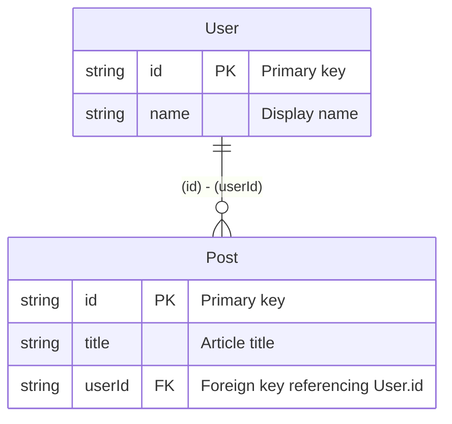

# Hekireki

**[Hekireki](https://www.npmjs.com/package/hekireki)** generates validation schemas, ORM models and
ER diagrams from a [Prisma](https://www.prisma.io/) schema — for TypeScript, Python, Go, Rust,
Elixir, Ruby, PHP and C# — and opens the schema, its documentation and its data in the browser with
[Hekireki Studio](#studio).

## Features

- **Validation schemas** — [Zod](https://zod.dev/), [Valibot](https://valibot.dev/), [ArkType](https://arktype.io/), [Effect Schema](https://effect.website/docs/schema/introduction/), [TypeBox](https://github.com/sinclairzx81/typebox), [AJV](https://ajv.js.org/) (JSON Schema) and [Pydantic](https://docs.pydantic.dev/) v2, written from the `///` [annotations](#annotations) on each field
- **ORM models and DDL** — [Drizzle](https://orm.drizzle.team/), [Kysely](https://kysely.dev/), [SQLAlchemy](https://www.sqlalchemy.org/), [Django](https://www.djangoproject.com/), [GORM](https://gorm.io/), [Sea-ORM](https://www.sea-ql.org/SeaORM/), [Ecto](https://hexdocs.pm/ecto/Ecto.Schema.html), [Active Record](https://guides.rubyonrails.org/active_record_basics.html), [Eloquent](https://laravel.com/docs/eloquent), [EF Core](https://learn.microsoft.com/ef/core/) and [Atlas](https://atlasgo.io/) HCL — with relations, enums, composite keys, indexes and `@@map` / `@map` throughout
- **ER diagrams** — [Mermaid](https://mermaid.js.org/), [DBML](https://dbml.dbdiagram.io/), PNG and SVG from one generator block, with crow's-foot cardinality and `PK` / `FK` / `UK` markers
- **[Hekireki Studio](#studio)** — the ER diagram, a reference docs page, every model's data, a Prisma editor and a SQL console, live from `schema.prisma`

## Installation

```bash
npm install -D hekireki
```

## Usage

Each generator is a `generator` block in `schema.prisma`. `output` is **required**: point it at a
directory to get the default file name of that generator, or at a path with an extension to name
the file yourself. `hekireki-er` is the exception: it has no default file name, so it only takes
paths to files, extension included (see [ER diagrams](#er-diagrams)).

```prisma
datasource db {
    provider = "sqlite"
}

generator Hekireki-Zod {
    provider = "hekireki-zod"
    output   = "./zod"
    type     = true
    comment  = true
    relation = true
}

model User {
    /// Primary key
    /// @z.uuid()
    id    String @id @default(uuid())
    /// Display name
    /// @z.string().min(1).max(50)
    name  String
    posts Post[]
}

model Post {
    /// Primary key
    /// @z.uuid()
    id     String @id @default(uuid())
    /// Article title
    /// @z.string().min(1).max(100)
    title  String
    /// Foreign key referencing User.id
    /// @z.uuid()
    userId String
    user   User   @relation(fields: [userId], references: [id])
}
```

`npx prisma generate` writes `./zod/index.ts`:

```ts
import * as z from 'zod'

export const UserSchema = z.object({
  /**
   * Primary key
   */
  id: z.uuid(),
  /**
   * Display name
   */
  name: z.string().min(1).max(50),
})

export type User = z.infer<typeof UserSchema>

export const PostSchema = z.object({
  /**
   * Primary key
   */
  id: z.uuid(),
  /**
   * Article title
   */
  title: z.string().min(1).max(100),
  /**
   * Foreign key referencing User.id
   */
  userId: z.uuid(),
})

export type Post = z.infer<typeof PostSchema>

export const UserRelationsSchema = z.object({
  ...UserSchema.shape,
  posts: z.array(PostSchema),
})

export type UserRelations = z.infer<typeof UserRelationsSchema>

export const PostRelationsSchema = z.object({
  ...PostSchema.shape,
  user: UserSchema,
})

export type PostRelations = z.infer<typeof PostRelationsSchema>
```

Every other generator reads the same schema. What each one writes is easiest to read as real
output: [`example/schema.prisma`](https://github.com/nakita628/hekireki/blob/main/example/schema.prisma)
exercises all of them at once — enums, `@@map`, composite keys, self-relations, implicit
many-to-many, native `@db.*` types — and the output of every generator for it is committed under
[`example/generated/`](https://github.com/nakita628/hekireki/tree/main/example/generated).

## Annotations

A `///` comment on a field is its documentation. A `///` line that begins with one of the prefixes
below is the validation the matching generator emits for that field, used verbatim:

| Prefix | Generator         | Example                                   |
| ------ | ----------------- | ----------------------------------------- |
| `@z.`  | Zod               | `/// @z.string().min(1).max(50)`          |
| `@v.`  | Valibot           | `/// @v.pipe(v.string(), v.minLength(1))` |
| `@a.`  | ArkType           | `/// @a."1 <= string <= 50"`              |
| `@e.`  | Effect Schema     | `/// @e.Schema.UUID`                      |
| `@t.`  | TypeBox           | `/// @t.Type.String({ format: 'uuid' })`  |
| `@j.`  | AJV / JSON Schema | `/// @j.{ type: 'string' as const }`      |
| `@p.`  | Pydantic          | `/// @p.EmailStr`                         |

A field without an annotation falls back to the Prisma type. `@p.ConfigDict(...)` on a **model** is
passed through as Pydantic's `model_config`.

`/// @relation <Parent>.<field> <Child>.<field> <cardinality>` on a **model** declares a relation
that has no physical foreign key — it is drawn in the Mermaid, DBML and image output (dashed in the
drawing) even though the column carries no `@relation(...)`:

```prisma
/// @relation User.id Post.userId one-to-many
model Post {
  id     String @id @default(uuid())
  userId String
}
```

## Generators

| `provider`              | Target                     | Default output                              | Options                              |
| ----------------------- | -------------------------- | ------------------------------------------- | ------------------------------------ |
| `hekireki-zod`          | TypeScript                 | `index.ts`                                  | `type`, `comment`, `relation`, `zod` |
| `hekireki-valibot`      | TypeScript                 | `index.ts`                                  | `type`, `comment`, `relation`        |
| `hekireki-arktype`      | TypeScript                 | `index.ts`                                  | `type`, `comment`, `relation`        |
| `hekireki-effect`       | TypeScript                 | `index.ts`                                  | `type`, `comment`, `relation`        |
| `hekireki-typebox`      | TypeScript                 | `index.ts`                                  | `type`, `comment`, `relation`        |
| `hekireki-ajv`          | TypeScript                 | `index.ts`                                  | `type`, `comment`, `relation`        |
| `hekireki-drizzle`      | TypeScript                 | `schema.ts`                                 | —                                    |
| `hekireki-kysely`       | TypeScript                 | `types.ts`                                  | —                                    |
| `hekireki-pydantic`     | Python                     | `models.py`                                 | `comment`, `relation`                |
| `hekireki-sqlalchemy`   | Python                     | `models.py`                                 | —                                    |
| `hekireki-django`       | Python (Django ≥ 5.2)      | `models.py`                                 | —                                    |
| `hekireki-gorm`         | Go                         | `models.go`                                 | `package`                            |
| `hekireki-sea-orm`      | Rust                       | one `.rs` per model, `mod.rs`, `prelude.rs` | `renameAll`                          |
| `hekireki-ecto`         | Elixir                     | one `.ex` per model                         | `app`                                |
| `hekireki-activerecord` | Ruby (Rails ≥ 7.1)         | one `.rb` per model                         | —                                    |
| `hekireki-eloquent`     | PHP (Laravel, PHP ≥ 8.1)   | one `.php` per model and enum               | `namespace`                          |
| `hekireki-efcore`       | C# (EF Core ≥ 9, .NET ≥ 9) | one `.cs` per model and enum, the DbContext | `namespace`, `context`               |
| `hekireki-atlas`        | Atlas HCL                  | `schema.hcl`                                | `schemaName`, `comment`              |
| `hekireki-er`           | Mermaid / DBML / PNG / SVG | — ([extension required](#er-diagrams))      | `outputs`, `theme`                   |

## Configuration

```prisma
generator Hekireki-Zod {
    provider = "hekireki-zod"
    output   = "./zod"       // Required. A directory here yields ./zod/index.ts
    type     = true          // TypeScript types (default: false)
    comment  = true          // /// comments as doc comments (default: false)
    relation = true          // <Model>Relations schemas (default: false)
    zod      = "v4"          // "v4" | "mini" | "@hono/zod-openapi" (default: v4)
}

// Valibot, ArkType, Effect Schema, TypeBox and AJV take the same type / comment / relation options.
generator Hekireki-Valibot {
    provider = "hekireki-valibot"
    output   = "./valibot"
    type     = true
    comment  = true
    relation = true
}

generator Hekireki-Pydantic {
    provider = "hekireki-pydantic"
    output   = "./pydantic"  // A directory here yields ./pydantic/models.py
    comment  = true          // /// comments as docstrings (default: false)
    relation = true          // <Model>Relations subclasses (default: false)
}

// Drizzle, Kysely, SQLAlchemy, Django and Active Record take output alone.
generator Hekireki-Drizzle {
    provider = "hekireki-drizzle"
    output   = "./drizzle"   // A directory here yields ./drizzle/schema.ts
}

generator Hekireki-Atlas {
    provider   = "hekireki-atlas"
    output     = "./atlas"   // A directory here yields ./atlas/schema.hcl
    schemaName = "public"    // Schema label (default: postgresql/mysql "public", sqlite "main")
    comment    = true        // /// comments as comment attributes (default: false)
}

generator Hekireki-GORM {
    provider = "hekireki-gorm"
    output   = "./gorm"      // A directory here yields ./gorm/models.go
    package  = "model"       // Go package name (default: model)
}

generator Hekireki-SeaORM {
    provider  = "hekireki-sea-orm"
    output    = "./sea_orm"
    renameAll = "camelCase"  // #[serde(rename_all = "...")] (optional)
}

generator Hekireki-Ecto {
    provider = "hekireki-ecto"
    output   = "./ecto"
    app      = "MyApp"       // Module prefix (default: MyApp)
}

generator Hekireki-Eloquent {
    provider  = "hekireki-eloquent"
    output    = "./eloquent"
    namespace = "App.Models" // PHP namespace, "." becomes "\" (default: App\Models)
}

// PostgreSQL only: the model maps onto the tables Prisma Migrate creates there, through Npgsql.
generator Hekireki-EFCore {
    provider  = "hekireki-efcore"
    output    = "./efcore"      // A directory: one .cs per model and enum, and the DbContext
    namespace = "MyApp.Models"  // C# namespace (default: Models)
    context   = "ShopContext"   // DbContext class name (default: AppDbContext)
}

// ER takes output or outputs (not both). Every path is a file ending in .md, .dbml, .png or .svg,
// never a directory, and its extension picks the format (see ER diagrams).
generator Hekireki-ER {
    provider = "hekireki-er"
    // output = "docs/er.md"                                      // One file: output alone is enough
    outputs  = ["docs/er.md", "docs/schema.dbml", "docs/er.svg"]  // Several files: list them here
    theme    = "light"                                            // .png / .svg only. "light" (default) or "dark"
}
```

## ER diagrams

`hekireki-er` writes the ER model of the schema in four formats, and the extension of each file
picks which — so the file you name is the file you get. Unlike the other generators it has no
default file name, so every file has to be named with one of these extensions:

| Extension | Writes                 |
| --------- | ---------------------- |
| `.md`     | A Mermaid `erDiagram`  |
| `.dbml`   | DBML                   |
| `.png`    | The diagram, as a PNG  |
| `.svg`    | The diagram, as an SVG |

Name the files with `output` or with `outputs` — one of the two, not both. When one file is all
you need, `output` alone is enough:

```prisma
generator Hekireki-ER {
    provider = "hekireki-er"
    output   = "docs/er.md"  // Writes docs/er.md
}
```

For several formats at once, list them in `outputs` instead:

```prisma
generator Hekireki-ER {
    provider = "hekireki-er"
    outputs  = ["docs/er.md", "docs/er.svg"]  // Writes docs/er.md and docs/er.svg
}
```

Every path is a whole file, directory and extension included, resolved the way Prisma resolves any
`output`: against the directory of the schema file that declares the generator. Neither ever names
a directory, so a path with no extension, or with one outside the four, is an error rather than a
guess — `output = "docs"` fails.

Every option belongs to a format (`theme` to `.png` and `.svg`), and setting one that no chosen
format reads is an error — so an option never looks like it did something it did not.

`.md` writes a Mermaid diagram:


```mermaid
erDiagram
    User ||--o{ Post : "(id) - (userId)"
    User {
        string id PK "Primary key"
        string name "Display name"
    }
    Post {
        string id PK "Primary key"
        string title "Article title"
        string userId FK "Foreign key referencing User.id"
    }
```

`.dbml` writes the same model for [dbdiagram.io](https://dbml.dbdiagram.io/) as the database
names it: tables, columns, enums and enum values under their `@@map` / `@map` names wherever the
schema declares one. `.png` and `.svg`
draw the diagram Hekireki Studio shows, laid out automatically: a card per model and enum, its
fields with `🔑` / `🔗` / `UK` marks, the attributes and `///` prose under each, the `@@id` /
`@@unique` / `@@index` block attributes, and an edge per relation in crow's-foot notation captioned
with its cardinality and referential action. No external renderer is involved, and the PNG is
rasterised at 2x. Use `.svg` for files in the repository and `.png` where images are embedded.
Studio's Schema page exports both with the models where you dragged them.

## Studio

`hekireki studio` opens the schema in the browser, served locally by [Hono](https://hono.dev/).
Nothing is generated first — Studio reads `schema.prisma` itself and reloads on every edit to it:

```bash
# Open ./prisma/schema.prisma, then ./schema.prisma (default: http://localhost:5555)
hekireki studio

# Read a multi-file schema: every .prisma file directly in the directory, together
hekireki studio --schema prisma/schema

# Browse a database of your choosing
hekireki studio --url file:./dev.db

# Listen on another port
hekireki studio -p 3000
```

| Page             | What it is                                                                        |
| ---------------- | --------------------------------------------------------------------------------- |
| `/` — Schema     | The ER diagram, laid out automatically, with **PNG** / **SVG** export             |
| `/docs` — Docs   | The reference page: every model and enum with its fields, attributes and comments |
| `/models/<name>` | A model's rows, editable, next to its fields                                      |
| `/enums/<name>`  | An enum with its members and the fields that hold it                              |
| `/prisma`        | The schema in a Prisma editor, with the language server's diagnostics             |
| `/sql`           | A SQL console: completion from the schema, a data-flow picture, the query plan    |

**⌘K** / **Ctrl+K** opens a search over the whole schema — every page, model, enum and field, by
the letters of its name in order, so `usemail` finds `User.email`. Following a field opens its
model on that row.

On a model's page, **/** puts the cursor in the search box and every column is searched as you
type, with what matched marked in the rows that come back. Clicking a cell picks it and nothing
more; the two buttons that appear on it copy just that value or open it for editing, and **⌘C** /
**Ctrl+C** copies the picked cell. Tick rows to act on them together: **Copy** takes them as
tab-separated text — what a spreadsheet pastes — and **Delete** asks first, naming the rows it is
about to remove. **Export** downloads or copies the page as CSV or JSON. A SQL result is sorted and narrowed in the browser,
without asking the database a second question.

The SQL page completes table and column names from the schema — `@@map` / `@map` names, as the
database knows them — and reads the statement as you type: **Flow** draws where its rows come from
(every table, join, filter, grouping and the projection), **Columns** traces each result column back
to the base tables and lists every table touched with its alias and the columns read, and **Type**
shows the row and parameter types as TypeScript, and **Plan** asks the database for its execution
plan (`EXPLAIN`) as a tree. The models the statement touches light up on the
schema beside it, with the columns it reads marked; a `?` or `$1` placeholder gets a field typed
from the column it is compared with, and a name the schema does not know is underlined.

**Columns** in the toolbar says which columns the grid draws, remembered per model; what is on
screen is what **Copy** and **Export** take, so a copy of two columns out of forty is two ticks
away. A row is still written whole, so the Add row form brings every column back for as long as it
is open.

`--schema` takes either a `schema.prisma` file or a directory — every `.prisma` file directly in the
directory (subdirectories are not descended into) is read as one schema, which is how Prisma's
[multi-file schema](https://www.prisma.io/docs/orm/prisma-schema/overview/location#multi-file-prisma-schema)
(`prisma/schema/`) is opened. Without the flag, `./prisma/schema.prisma` then `./schema.prisma` are
looked for — the same two paths the Prisma CLI defaults to. Either way the whole directory is
watched, so a `.prisma` file added to it appears in Studio without a restart.

The database is the one `--url` names, or `DATABASE_URL` from the environment or `.env`, then
`datasource.url` in `prisma.config.ts`; `postgres://`, `mysql://` and `file:` are understood. A
relative `file:` path is resolved from the schema directory, as Prisma resolves it — with the
default `prisma/schema.prisma`, `file:./dev.db` is `prisma/dev.db`. Without a database, Studio
serves the schema alone — the diagram, the docs and the editor still work.

The HTTP API behind it is documented in [docs/studio-api.md](https://github.com/nakita628/hekireki/blob/main/packages/hekireki/docs/studio-api.md).

## Notes

- **Atlas** — declarative `atlas schema apply` drops whatever is missing from the HCL, and Prisma's
  `_prisma_migrations` table, `@ignore`d columns and `Unsupported(...)` types can never appear in it.
  Dry-run first and exclude the migrations table: `--exclude '_prisma_migrations'`.
- **Kysely** — only **database-side** defaults become `Generated<T>`. `uuid()`, `cuid()`, `ulid()`
  and `nanoid()` are evaluated by the Prisma Client, so a raw Kysely insert must still supply them.
- **Django** — enums become `TextChoices` + `TextField(choices=…)` (Django has no native PostgreSQL
  enum type), a foreign key to a composite `@@id` / `@@unique` is emitted as the scalar columns
  without a relation, `onUpdate` is dropped, and a plain `DateTime` maps to `DateTimeField` while
  Prisma stores `timestamp` — annotate it `@db.Timestamptz` to keep `USE_TZ = True` reads aware.
- **Eloquent** — a composite primary key is emitted as `protected $primaryKey = null;`, because
  Eloquent has no native support for one. Active Record writes the real
  `self.primary_key = [...]` (Rails ≥ 7.1).
- **EF Core** — PostgreSQL only, through
  [Npgsql](https://www.npgsql.org/efcore/) 9 or later. Register the context with its enum mappings,
  `services.AddDbContext<AppDbContext>(o => o.UseNpgsql(connectionString, AppDbContext.MapEnums))`
  (`AddDbContextPool` alike); if you hand Npgsql your own `NpgsqlDataSource`, call
  `AppDbContext.MapEnums(dataSourceBuilder)` on its builder too. Without them, reading or writing an
  enum column fails. `ulid()` needs the [`Ulid`](https://www.nuget.org/packages/Ulid) package and
  `cuid()` / `cuid(2)` [`cuid.net`](https://www.nuget.org/packages/cuid.net); `uuid()` and
  `nanoid()` need nothing more.
  - Npgsql cannot read a `numeric` with a scale over 28 into `decimal`, and a `Decimal` without
    `@db.Decimal` is `numeric(65,30)` on PostgreSQL: give such fields a scale of 28 or less, e.g.
    `@db.Decimal(38, 18)`, before reading them through EF Core.
  - Defaults behave as with Prisma Client: a new entity starts out holding them, an explicit value —
    `0`, `false`, `null` included — is written as it is, and `@updatedAt` is set in `SaveChanges`
    (not by `ExecuteUpdate`). A timestamp default with an offset is the UTC instant it names, as
    Prisma Client writes it.
  - What EF Core cannot say about the database, and leaves to it: `onUpdate` actions;
    `SetDefault`, and `Restrict` / `NoAction` on an optional relation, as `onDelete` actions — these
    become `ClientNoAction`, so that EF Core never sets the foreign keys of loaded rows to null on
    its own; and a model without `@id`, which EF Core keys by its first unique criterion. Constraint
    names are the ones Prisma derives (a `map:` on `@relation` is not in DMMF), enums are mapped
    in the default schema (DMMF has no `@@schema` for an enum), and a `view` is mapped as a table
    (DMMF does not tell the two apart).
  - Prisma creates no index for a foreign key, so the context removes EF Core's convention that
    would add one.

## License

Distributed under the MIT License. See [LICENSE](https://github.com/nakita628/hekireki?tab=MIT-1-ov-file) for more information.
