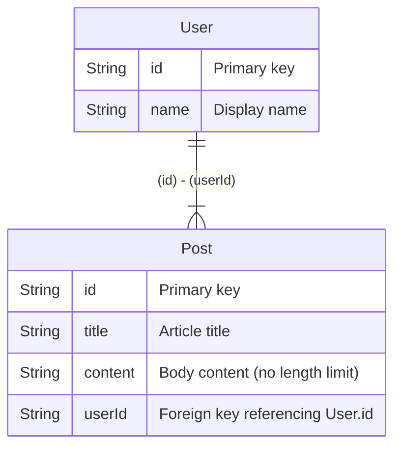

```mermaid
erDiagram
    User ||--}| Post : "(id) - (userId)"
    User {
        String id "Primary key"
        String name "Display name"
    }
    Post {
        String id "Primary key"
        String title "Article title"
        String content "Body content (no length limit)"
        String userId "Foreign key referencing User.id"
    }
```