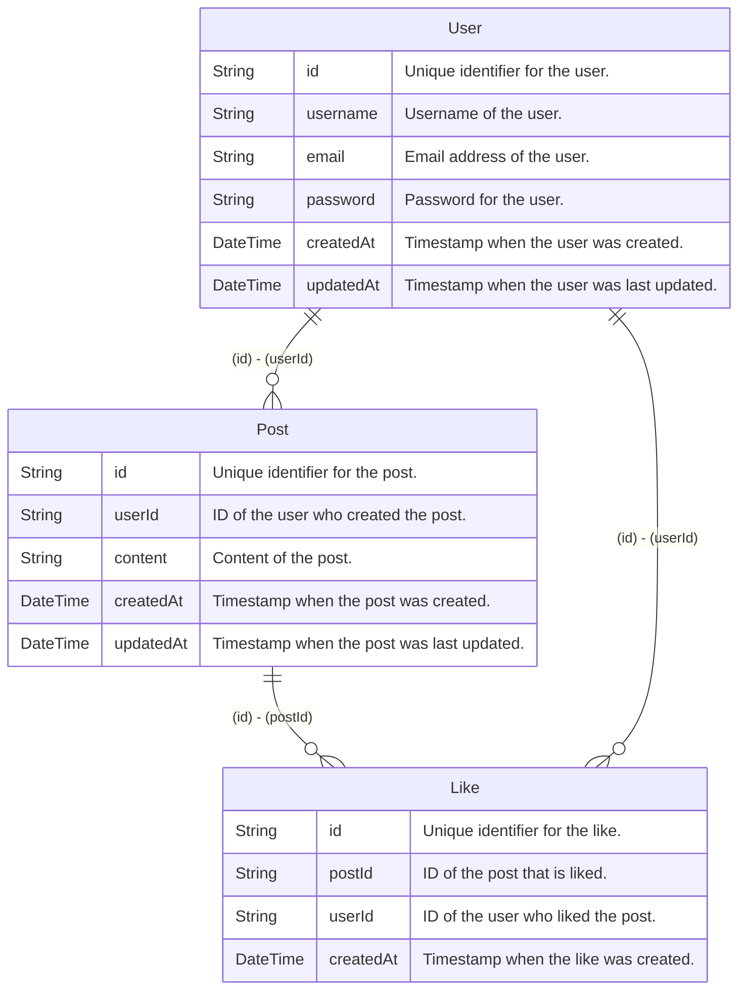

```mermaid
erDiagram
    User ||--o{ Post : "(id) - (userId)"
    Post ||--o{ Like : "(id) - (postId)"
    User ||--o{ Like : "(id) - (userId)"
    User {
        String id "Unique identifier for the user."
        String username "Username of the user."
        String email "Email address of the user."
        String password "Password for the user."
        DateTime createdAt "Timestamp when the user was created."
        DateTime updatedAt "Timestamp when the user was last updated."
    }
    Post {
        String id "Unique identifier for the post."
        String userId "ID of the user who created the post."
        String content "Content of the post."
        DateTime createdAt "Timestamp when the post was created."
        DateTime updatedAt "Timestamp when the post was last updated."
    }
    Like {
        String id "Unique identifier for the like."
        String postId "ID of the post that is liked."
        String userId "ID of the user who liked the post."
        DateTime createdAt "Timestamp when the like was created."
    }
```